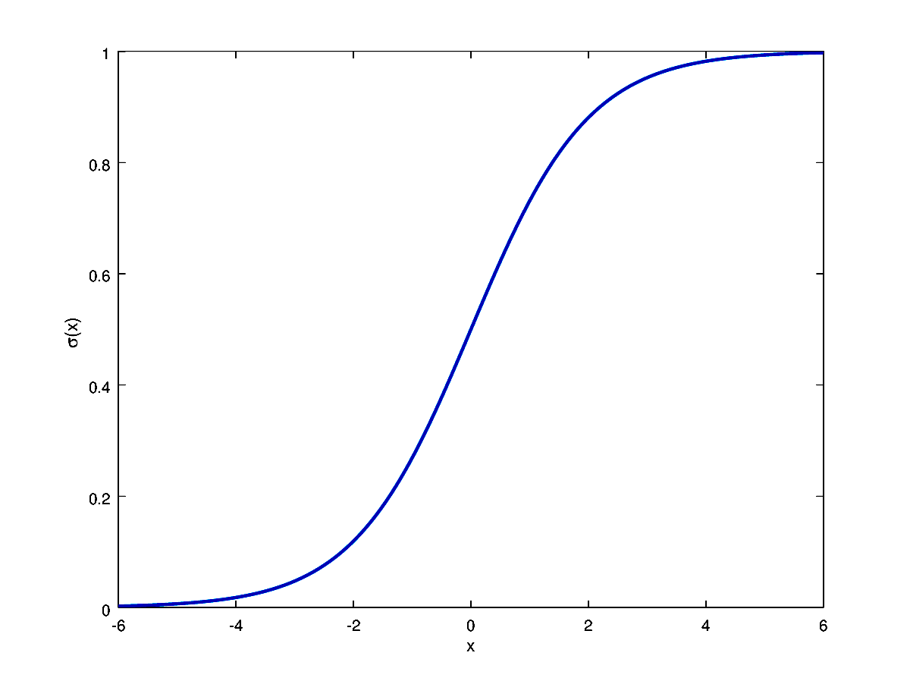

```{r setup, include=FALSE}
knitr::opts_chunk$set(echo = FALSE)
```

Although the name might confuse, please note that this is a *classification* algorithm.

In *Logistic Regression*, we define a set weights $\mathbf{w}$ that should be combined (through a trivial dot product) with some features $\phi$.
Considering a problem of two-class classification, the posterior probability of class $C_1$ can be written as a logistic sigmoid function:

$$
p(C_1\vert\phi) = \frac{1}{1+e^{-\mathbf{w}^T\phi}}=\sigma(\mathbf{w}^T\phi)
$$



and $p(C_2\vert\phi) = 1 - p(C_1\vert\phi)$ 

Applying the *Maximum Likelihood* approach...

Given a dataset $\mathcal{D} = \{(\mathbf{\phi}_n,t_n)\ \forall n\in[1,N]\}$, $t_n \in \{0,1\}$, we have to maximize the probability of getting the right label:

$$
P(\mathbf{t}\vert\mathbf{\Phi},\mathbf{w}) = \prod_{n=1}^{N}y_n^{t_n}(1-y_n)^{1-t_n},\ \ y_n = \sigma(\mathbf{w}^T\phi_n)
$$

Taking the negative log of the likelihood, the *cross-entropy* error function can be defined and it has to be minimized:

$$
L(\mathbf{w}) = -\ln P(\mathbf{t}\vert\mathbf{\Phi},\mathbf{w}) = -\sum_{n=1}^{N}(t_n\ln y_n+(1-t_n)\ln(1-y_n))=\sum_{n}^NL_n
$$

Differentiating and using the chain rule:

$$
\frac{\partial L_n}{\partial y_n}= \frac{y_n-t_n}{y_n(1-y_n)},\ \ \ \ \frac{\partial y_n}{\partial\mathbf{w}}=y_n(1-y_n)\phi_n\\
\frac{\partial L_n}{\partial \mathbf{w}}= \frac{\partial L_n}{\partial y_n}\frac{\partial y_n}{\partial\mathbf{w}}=(y_n-t_n)\phi
$$

The gradient of the loss function is

$$
\nabla L(\mathbf{w}) = \sum_{n=1}^{N}(y_n-t_n)\phi_n
$$

It has the same form as the gradient of the sum-of-squares error function for linear regression. But in this case $y$ is not a linear function of $\mathbf{w}$ and so, there is no closed form solution. The error function is *convex* (only one optimum) and can be optimized by standard *gradient-based* optimization techniques. It is, hence, easy to adapt to the online learning setting.

Talking about *Multiclass Logistic Regression*...

For the multiclass case, the posterior probabilities can be represented by a *softmax* transformation of linear functions of feature variables:

$$
p(C_k\vert\phi)=y_k(\phi)=\frac{e^{\mathbf{w}_k^T\phi}}{\sum_j e^{\mathbf{w}_j^T\phi}}
$$

$\phi(\mathbf{x})$ has been abbreviated with $\phi$ for simplicity.

*Maximum Likelihood* is used to directly determine the parameters

$$
p(\mathbf{T}\vert\Phi,\mathbf{w}_1,\dots,\mathbf{w}_K)=\prod_{n=1}^{N}{\underset{\text{Term for correct class$\;\;\;\;\;\;\;\;\;\;\;\;\;\;\,\,\;\;\;\;\;\;\;\;\;\;\;$}}{\underbrace{\left(\prod_{k=1}^{K}p(C_k\vert\phi_n)^{t_{nk}}\right)}=\prod_{n=1}^{N}\left(\prod_{k=1}^{K}y_{nk}^{t_{nk}}\right)}}\\
$$

where $y_{nk}=p(C_k\vert\phi_n)=\frac{e^{\mathbf{w}_k^T\phi_n}}{\sum_j e^{\mathbf{w}_j^T\phi_n}}$

The *cross-entropy* function is:

$$
L(\mathbf{w}_1,\dots,\mathbf{w}_K)=-\ln p(\mathbf{T}\vert\Phi,\mathbf{w}_1,\dots,\mathbf{w}_K)=-\sum_{n=1}^{N}\left(\sum_{k=1}^{K}t_{nk}\ln y_{nk}\right)
$$

Taking the gradient

$$
\nabla L_{\mathbf{w}_j}(\mathbf{w}_1,\dots,\mathbf{w}_K) =\sum_{n=1}^{N}(y_{nj}-t_{nj})\phi_n
$$


