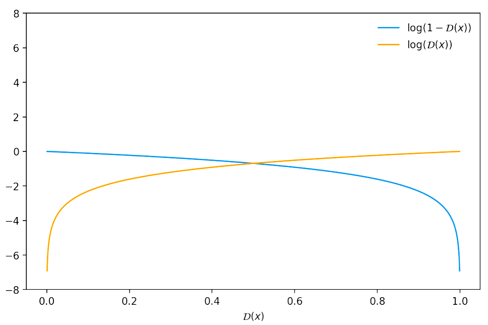
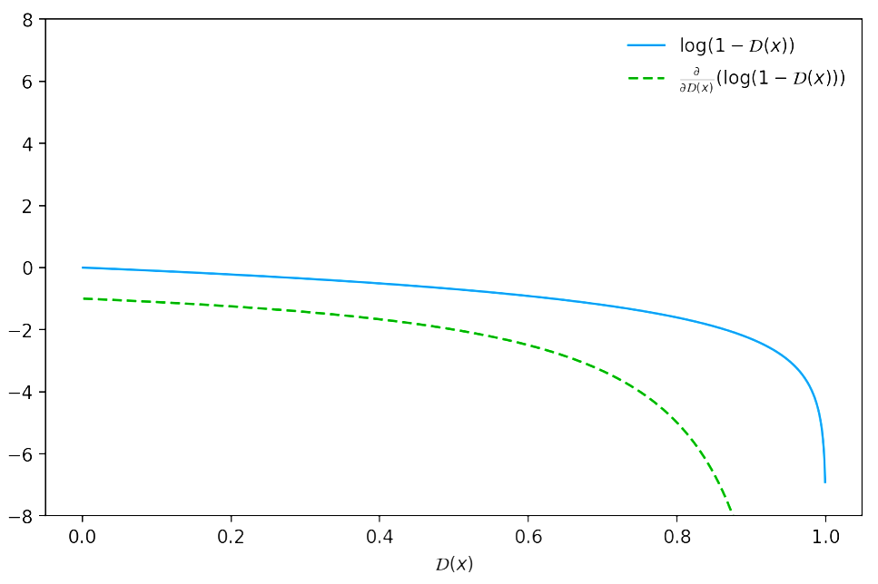
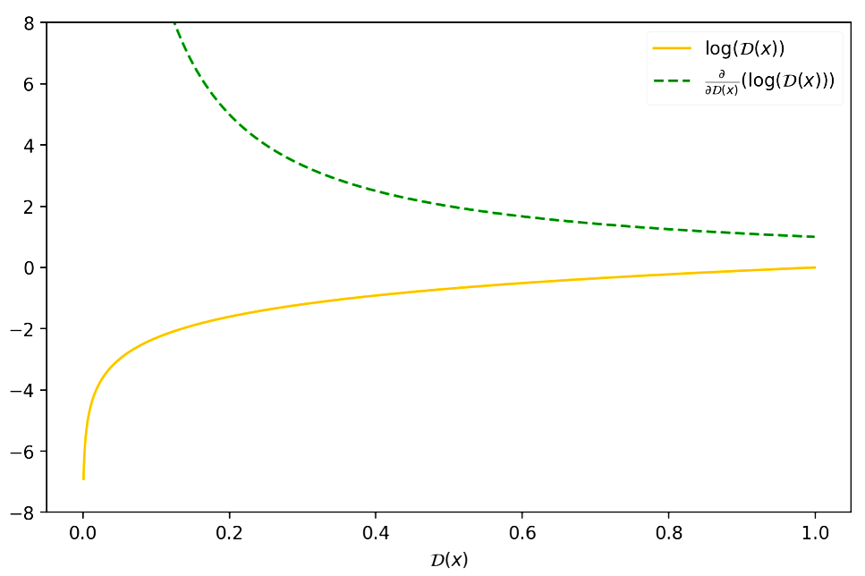

```{r setup, include=FALSE}
knitr::opts_chunk$set(echo = FALSE)
```

Let's start with a question: *what is Generative Modeling?*

Generative modeling is an ***unsupervised learning*** task in machine learning that involves automatically discovering and learning the regularities or patterns in input data in such a way that the model can be used to *generate or output new examples* that plausibly could have been drawn from the original dataset.

GANs are a clever way of training a generative model by framing the problem as a ***supervised learning*** problem with two sub-models: the ***generator*** model that we train to generate new examples, and the ***discriminator*** model that tries to classify examples as either real (from the domain) or fake (generated).

### Formulation

- Generator $\mathcal{G}$: produces realistic samples e.g. taking as input some random noise. $\mathcal{G}$ tries to fool the discriminator

- Discriminator $\mathcal{D}$ that takes as input an image and assess whether it is real or generated by $\mathcal{G}$

Both $\mathcal{D}$ and $\mathcal{G}$ are conveniently chosen as MLPs.
The generative process depends on two networks:

- $\mathcal{D} =\mathcal{D}(\mathbf{x},\theta_d)$

- $\mathcal{G} =\mathcal{G}(\mathbf{z},\theta_g)$

$\theta_g$ and $\theta_d$ are the network parameters, $\mathbf{x}\in\mathbb{R}^n$ is an input image (either real or generated by $\mathcal{G}$) and $\mathbf{z}\in\mathbb{R}^d$ is some random noise to be fed to the generator.
We suppose that $\mathbf{x}$ is sampled from a distribution $p_{data}$ $($i.e. $\mathbf{x}\sim p_{data}(\mathbf{x}))$ and $\mathbf{z}$ is sampled from a distribution $p_z$ $($i.e. $\mathbf{z}\sim p_z(\mathbf{z}))$.
Our Discriminator's output is to be seen as the probability that the input image comes from the data and not from the generator:
$$
\mathcal{D}(\cdot,\theta_d):\mathbb{R}^n \to [0,1]
$$

The generator gives as output a generated image:
$$
\mathcal{G}(\cdot,\theta_d):\mathbb{R}^d \to \mathbb{R}^n
$$
A *good discriminator* is such that:

- $\mathcal{D}(\mathbf{x},\theta_d)$ is maximum when $\mathbf{x} \in X$ (i.e. $\mathbf{x}$ is sampled for the real images dataset $X$)
- $1 - \mathcal{D}(\mathbf{x},\theta_d)$ is maximum when $\mathbf{x}$ was generated by $\mathcal{G}$

- $1 - \mathcal{D}(\mathcal{G}(\mathbf{z},\theta_g),\theta_d)$ is maximum when $\mathbf{z} \sim p_z(\mathbb{z})$

Training $\mathcal{D}$ consists in maximizing the binary cross-entropy:


$$
\underset{\theta_d}{\text{max}}
\left(\ 
\mathbb{E}_{\mathbf{x}\sim p_{data}(\mathbf{x})}
[\log\mathcal{D}(\mathbf{x},\theta_d)]
+
\mathbb{E}_{\mathbf{z}\sim p_z(\mathbf{z})}
\log[1-\mathcal{D}(\mathcal{G}(\mathbf{z},\theta_g),\theta_d)]
\ \right)
$$


Where

- $\mathcal{D}(\mathbf{x},\theta_d)$  has to be $1$ since $\mathbf{x} \sim p_{data}(\mathbf{x})$, namely images are real.
- $\mathcal{D}(\mathcal{G}(\mathbf{z},\theta_g),\theta_d)$ has to be $0$ since $\mathcal{G}(\mathbf{z},\theta_g)$ is a generated (fake) image.

A *good generator* $\mathcal{G}$ is one that makes $\mathcal{D}$ fail:


$$
\underset{\theta_g}{\text{min}}
\left(
\underset{\theta_d}{\text{max}}
\left(\ 
\mathbb{E}_{\mathbf{x}\sim p_{data}(\mathbf{x})}
[\log\mathcal{D}(\mathbf{x},\theta_d)]
+
\mathbb{E}_{\mathbf{z}\sim p_z(\mathbf{z})}
\log[1-\mathcal{D}(\mathcal{G}(\mathbf{z},\theta_g),\theta_d)]
\ 
\right)
\right)
$$


Optimizing $\mathcal{D}$ to completion in the inner loop of training is computationally prohibitive, and on finite datasets would result in overfitting. Instead, we alternate between $k$ steps of optimizing $\mathcal{D}$ and one step of optimizing $\mathcal{G}$. This results in $\mathcal{D}$ being maintained near its optimal solution, as long as $\mathcal{G}$ changes slowly enough.

Let's schematize it: 

We need to solve by an iterative numerical approach the min max game shown at $(4)$. 
In order to do so we alternate:

- $k$-steps of Stochastic Gradient Ascent w.r.t. $\theta_d$ to solve

	$$
	\underset{\theta_d}{\text{max}}
	\left(\ 
	\mathbb{E}_{\mathbf{x}\sim p_{data}(\mathbf{x})}
	[\log\mathcal{D}(\mathbf{x},\theta_d)]
	+
	\mathbb{E}_{\mathbf{z}\sim p_z(\mathbf{z})}
	\log[1-\mathcal{D}(\mathcal{G}(\mathbf{z},\theta_g),\theta_d)]
	\ 
	\right)
	$$

- $1$-step of Stochastic Gradient Descent w.r.t. $\theta_g$ being $\theta_d$ fixed:

	$$
	\underset{\theta_g}{\text{min}}
	\left(\ 
	\mathbb{E}_{\mathbf{x}\sim p_{data}(\mathbf{x})}
	[\log\mathcal{D}(\mathbf{x},\theta_d)]
	+
	\mathbb{E}_{\mathbf{z}\sim p_z(\mathbf{z})}
	\log[1-\mathcal{D}(\mathcal{G}(\mathbf{z},\theta_g),\theta_d)]
	\ 
	\right)
	$$

	i.e. (the removed term does not depend on $\theta_g$)

	$$
	\underset{\theta_g}{\text{min}}
	\left(\ 
	\mathbb{E}_{\mathbf{z}\sim p_z(\mathbf{z})}
	[\log(1-\mathcal{D}(\mathcal{G}(\mathbf{z},\theta_g),\theta_d))]
	\ 
	\right)
	$$

	i.e.

	$$
	\underset{\theta_g}{\text{max}}
	\left(\ 
	\mathbb{E}_{\mathbf{z}\sim\phi_z}
	[\log\mathcal{D}(\mathcal{G}(\mathbf{z},\theta_g),\theta_d)]
	\ 
	\right)
	$$

There is a reason why Goodfellow proposed to optimize $\log(\mathcal{D}(\cdot))$ instead of $\log(1-\mathcal{D}(\cdot))$.
If we try to descend the gradient of $\log(1-\mathcal{D}(x))$, we notice that at the beginning of the training process, when the generated samples would be easily classified as "fake" (i.e. $\mathcal{D}(x) \sim 0$), there would be too few gradient in order to learn properly!







We have the following value function for our min-max problem:

$$
V(\mathcal{G},\mathcal{D})
=
\mathbb{E}_{\mathbf{x}\sim p_{\text{data}}(\mathbf{x})}\log(\mathcal{D}(\mathbf{x}))\mathbf{x}+\mathbb{E}_{\mathbf{z}\sim p_{z}(\mathbf{z})}\log(1-\mathcal{D}(\mathcal{G}(\mathbf{z}))d\mathbf{z}
$$

$$
=\int_{\mathbf{x}}p_{\text{data}}(\mathbf{x})\log(\mathcal{D}(\mathbf{x}))d\mathbf{x}
+
\int_{\mathbf{z}}p_{\mathbf{z}}(\mathbf{z})\log(1-\mathcal{D}(\mathcal{G}(\mathbf{z}))d\mathbf{z}
$$

$$
=\int_{\mathbf{x}}
\left(
p_{\text{data}}(\mathbf{x})
\log(\mathcal{D}(\mathbf{x}))
+
p_{g}(\mathbf{x})
\log(1-\mathcal{D}(\mathbf{x}))
\right)
d\mathbf{x}
$$

This last equality comes from the Radon-Nikodym Theorem of measure theory and it’s sometimes referred as the *Law Of The Unconscious Statistician* (or LOTUS Theorem) since students have been accused of using the identity without realizing that it must be treated as the result of a rigorously proved theorem, not merely a definition (if you want the full proof check [this](https://www.lastweekspotatoes.com/posts/2021-07-22-lotus-theorem-in-original-gans-formulation/) out! )

$$
V(\mathcal{G},\mathcal{D})
=\int_{\mathbf{x}}
\left(
p_{\text{data}}(\mathbf{x})
\log(\mathcal{D}(\mathbf{x}))
+
p_{g}(\mathbf{x})
\log(1-\mathcal{D}(\mathbf{x}))
\right)
d\mathbf{x}
$$

Let's first consider the optimal discriminator $\mathcal{D}$ for any given generator $\mathcal{G}$.
The training criterion for the discriminator $\mathcal{D}$, given any generator $\mathcal{G}$, is to maximize the quantity defined below:

$$
\underset{\mathcal{D}}{\text{argmax}}\left(V(\mathcal{G},\mathcal{D})\right)
=\underset{\mathcal{D}}{\text{argmax}}\left(\int_{\mathbf{x}}
\left(
p_{\text{data}}(\mathbf{x})
\log(\mathcal{D}(\mathbf{x}))
+
p_{g}(\mathbf{x})
\log(1-\mathcal{D}(\mathbf{x}))
\right)
d\mathbf{x}
\right)
$$

For the individual sample $\mathbf{x}$ we derive $V(\mathcal{G},\mathcal{D})$ w.r.t. $\mathcal{D}(\mathbf{x})$ and we equal this quantity to $0$ in order to find the optimal discriminator $\mathcal{D}(\mathbf{x})^{*}$ 

$$
\frac{d}{d\mathcal{D}(\mathbf{x})}\left(
p_{\text{data}}(\mathbf{x})
\log(\mathcal{D}(\mathbf{x}))
+
p_{g}(\mathbf{x})
\log(1-\mathcal{D}(\mathbf{x}))
\right)
=0
$$

$$
\frac{p_{data}(\mathbf{x})}{\mathcal{D}^{*}(\mathbf{x})}
-
\frac{p_{g}(\mathbf{x})}{1-\mathcal{D}^{*}(\mathbf{x})}=0
$$

$$
\frac{p_{data}(\mathbf{x})(1-\mathcal{D}^{*}(\mathbf{x}))-p_{g}(\mathbf{x})\mathcal{D}^{*}(\mathbf{x})}{\mathcal{D}^{*}(\mathbf{x})(1-\mathcal{D}^{*}(\mathbf{x}))}
=0
$$

$$
\frac{p_{data}(\mathbf{x})-p_{data}(\mathbf{x})\mathcal{D}^{*}(\mathbf{x})-p_{g}(\mathbf{x})\mathcal{D}^{*}(\mathbf{x})}{\mathcal{D}^{*}(\mathbf{x})(1-\mathcal{D}^{*}(\mathbf{x}))}
= 0
$$

$$
p_{data}(\mathbf{x})-p_{data}(\mathbf{x})\mathcal{D}^{*}(\mathbf{x})-p_{g}(\mathbf{x})\mathcal{D}^{*}(\mathbf{x})
= 0
$$

$$
p_{data}(\mathbf{x})-\mathcal{D}^{*}(\mathbf{x})\left(p_{data}(\mathbf{x})+p_{g}(\mathbf{x})\right)
= 0
$$

$$
\color{blue}{\mathcal{D}^{*}(\mathbf{x})
=
\frac{p_{data}(\mathbf{x})}{p_{data}(\mathbf{x})+p_{g}(\mathbf{x})}
}
$$

Does this point represent a maximum? we have to check if the second derivative calculated in $\mathcal{D}^{\star}$ is negative.

$$
\frac{d}{d\mathcal{D}(\mathbf{x})}\left(
p_{\text{data}}(\mathbf{x})
\log(\mathcal{D}(\mathbf{x}))
+
p_{g}(\mathbf{x})
\log(1-\mathcal{D}(\mathbf{x}))
\right)
=
\frac{p_{data}(\mathbf{x})}{\mathcal{D}(\mathbf{x})}
-
\frac{p_{g}(\mathbf{x})}{1-\mathcal{D}(\mathbf{x})}
$$

$$
\frac{d^2}{d^2\mathcal{D}(\mathbf{x})}\left(
p_{\text{data}}(\mathbf{x})
\log(\mathcal{D}(\mathbf{x}))
+
p_{g}(\mathbf{x})
\log(1-\mathcal{D}(\mathbf{x}))
\right)
=
\frac{d}{d\mathcal{D}(\mathbf{x})}\left(\frac{p_{data}(\mathbf{x})}{\mathcal{D}(\mathbf{x})}
-
\frac{p_{g}(\mathbf{x})}{1-\mathcal{D}(\mathbf{x})}\right)
$$

$$
\frac{d}{d\mathcal{D}(\mathbf{x})}\left(\frac{p_{data}(\mathbf{x})}{\mathcal{D}(\mathbf{x})}
-
\frac{p_{g}(\mathbf{x})}{1-\mathcal{D}(\mathbf{x})}\right)
= 
-\frac{p_{data}(\mathbf{x})}{\mathcal{D}^2(\mathbf{x})}
-
\frac{p_{g}(\mathbf{x})}{\left(1-\mathcal{D}(\mathbf{x})\right)^2} < 0
$$

The quantity above is negative for every $\mathcal{D}$, $\mathcal{D}^*$ included, since $p_{data}(\mathbf{x})$ and $p_g(\mathbf{x})$ are between $0$ and $1$.

We then can plug $\mathcal{D^{\star}}$ into $\mathcal{V(G,D)}$ and find the optimal generator $\mathcal{G^{\star}}$ as:

$$
\int_{\mathbf{x}}\left(p_{\text{data}}(\mathbf{x})
\log(\mathcal{D}^{\star}(\mathbf{x}))
+
p_{g}(\mathbf{x})
\log(1-\mathcal{D}^{\star}(\mathbf{x}))\right)d\mathbf{x}
$$

$$
\mathcal{G}^{\star} =\underset{\mathcal{G}}{\text{argmin}}\left(\int_{\mathbf{x}}
\left(
p_{\text{data}}(\mathbf{x})
\log\left(\frac{p_{data}(\mathbf{x})}{p_{data}(\mathbf{x})+p_{g}(\mathbf{x})}\right)
+
p_{g}(\mathbf{x})
\log\left(1-\frac{p_{data}(\mathbf{x})}{p_{data}(\mathbf{x})+p_{g}(\mathbf{x})}\right)
\right)
d\mathbf{x}
\right)
$$

$$
\mathcal{G}^{\star} =\underset{\mathcal{G}}{\text{argmin}}\left(\int_{\mathbf{x}}
\left(
p_{\text{data}}(\mathbf{x})
\log\left(\frac{p_{data}(\mathbf{x})}{p_{data}(\mathbf{x})+p_{g}(\mathbf{x})}\right)
+
p_{g}(\mathbf{x})
\log\left(\frac{p_{g}(\mathbf{x})}{p_{data}(\mathbf{x})+p_{g}(\mathbf{x})}\right)
\right)
d\mathbf{x}
\right)
$$

$$
\mathcal{G}^{\star}=\underset{\mathcal{G}}{\text{argmin}}\left(
\int_{\mathbf{x}}
\left(
p_{\text{data}}(\mathbf{x})
\left(\log 2 - \log 2\right) +
p_{\text{data}}(\mathbf{x})
\log\left(\frac{p_{data}(\mathbf{x})}{p_{data}(\mathbf{x})+p_{g}(\mathbf{x})}\right)
\\
+
p_{\text{g}}(\mathbf{x})
\left(\log 2 - \log 2\right) +
p_{g}(\mathbf{x})
\log\left(\frac{p_{g}(\mathbf{x})}{p_{data}(\mathbf{x})+p_{g}(\mathbf{x})}\right)
\right)
d\mathbf{x}
\right)
$$

$$
\mathcal{G}^{\star}=\underset{\mathcal{G}}{\text{argmin}}\left(
-\log 2\int_{\mathbf{x}}\left(p_g(\mathbf{x})+p_{data}(\mathbf{x})\right)d\mathbf{x}
+
\int_{\mathbf{x}}
p_{\text{data}}(\mathbf{x})
\left(\log 2  + 
\log\left(\frac{p_{data}(\mathbf{x})}{p_{data}(\mathbf{x})+p_{g}(\mathbf{x})}
\right)\right)d\mathbf{x}\\
 +
\int_{\mathbf{x}}
p_{\text{g}}(\mathbf{x})
\left(\log 2  + 
\log\left(\frac{p_{g}(\mathbf{x})}{p_{data}(\mathbf{x})+p_{g}(\mathbf{x})}\right)\right)d\mathbf{x}
\right)
$$

$$
\mathcal{G}^{\star}=\underset{\mathcal{G}}{\text{argmin}}\left(
-\log 2 \cdot (2)
+
\int_{\mathbf{x}}
p_{\text{data}}(\mathbf{x}) 
\log\left(2\cdot\frac{p_{data}(\mathbf{x})}{p_{data}(\mathbf{x})+p_{g}(\mathbf{x})}
\right)d\mathbf{x}\\
 +
\int_{\mathbf{x}}
p_{\text{g}}(\mathbf{x})
\log\left(2\cdot\frac{p_{g}(\mathbf{x})}{p_{data}(\mathbf{x})+p_{g}(\mathbf{x})}\right)d\mathbf{x}
\right)
$$

$$
\mathcal{G}^{\star}=\underset{\mathcal{G}}{\text{argmin}}\left(
-\log 2^2
+
\int_{\mathbf{x}}
p_{\text{data}}(\mathbf{x}) 
\log\left(\frac{p_{data}(\mathbf{x})}{\frac{p_{data}(\mathbf{x})+p_{g}(\mathbf{x})}{2}}
\right)d\mathbf{x}\\
 +
\int_{\mathbf{x}}
p_{\text{g}}(\mathbf{x})
\log\left(\frac{p_{g}(\mathbf{x})}{\frac{p_{data}(\mathbf{x})+p_{g}(\mathbf{x})}{2}}\right)d\mathbf{x}
\right)
$$

$$
\mathcal{G}^{\star}=\underset{\mathcal{G}}{\text{argmin}}\left(
-\log 4
+
\mathit{KL}\left(p_{data}||\frac{p_g+p_{data}}{2}\right)
+
\mathit{KL}\left(p_{g}||\frac{p_g+p_{data}}{2}\right)
\right)
$$

$$
\color{blue}{\mathcal{G}^{\star}=\underset{\mathcal{G}}{\text{argmin}}\left(
-\log 4
+
2\cdot\mathit{JSD}(p_{data}||p_g)\right)}
$$

Where the *Kullback-Leibler divergence* (*KL*) and the *Jenson-Shannon divergence* (*JSD*) are quantities that measure the difference between two distributions and we know that $\mathit{JSD}(p_{data}\vert\vert p_g)=0$ only when $p_{data} = p_g$ !

$$
\implies V(\mathcal{D}^{\star}_{\mathcal{G}},\mathcal{G}) = -\log 4
$$

***Theorem*** $1$:

The global minimum of the virtual training criterion 
$$V(\mathcal{D}^{\star}_{\mathcal{G}},\mathcal{G})$$
is achieved if and only if $p_{g}=p_{data}$.
At that point, $V(\mathcal{D}^{\star}_{\mathcal{G}},\mathcal{G})$ achieves the value $−\log 4$.

Besides, that was what we expected! We wanted our generator to learn the *same* distribution which generated the data. If we know that $p_{data} = p_g$ then it's trivial to observe that at the end of the training process the optimal discriminator will be forced to output $0.5$ since it won't be able to distinguish between real and fake samples anymore.

$$
\color{blue}{\mathcal{D}^{\star}(\mathbf{x})
=
\frac{p_{data}(\mathbf{x})}{p_{data}(\mathbf{x})+p_{g}(\mathbf{x})}
= \frac{1}{2}}
$$

But does this converge?

Well, as stated in the original Paper:

*If $\mathcal{G}$ and $\mathcal{D}$ have enough capacity, and at each step of our algorithm, the discriminator is allowed to reach its optimum given $\mathcal{G}$ and $p_g$ is updated so as to improve the criterion*
$$
\mathbb{E}_{\mathbf{x}\sim p_{data}}\left[\log\mathcal{D}^{\star}_{G}(\mathbf{x})\right] + \mathbb{E}_{\mathbf{x}\sim p_{g}}\left[\log(1-\mathcal{D}^{\star}_{G}(\mathbf{x}))\right]
$$

*then $p_g$ converges to $p_{data}$.*

*Proof*:

*Consider* $V(\mathcal{G,D})= U(p_g,\mathcal{D})$ *as a function of* $p_g$ *as done in the above criterion. Note that* $U(p_g,\mathcal{D})$ *is convex in* $p_g$. 

*The subderivatives of a supremum of convex functions include the derivative of the function at the point where the maximum is attained. In other words, if* $f(x)=\sup_{\alpha\in\mathcal{A}}f_\alpha(x)$ *and* $f_\alpha(x)$ *is convex in* $x$ *for every* $\alpha$ , *then* $\partial f_\beta(x) \in \partial f$ *if* $\beta=\arg\sup_{\alpha\in\mathcal{A}}f_\alpha(x)$. *This is equivalent to computing a gradient descent update for* $p_g$ *at the optimal* $\mathcal{D}$ *given the corresponding* $\mathcal{G}$. $\sup_\mathcal{D}U(p_g,\mathcal{D})$ *is convex in* $p_g$ *with a unique global optima as proven in* *Theorem $1$*, *therefore with sufficiently small updates of* $p_g$, $p_g$ *converges to* $p_x$, *concluding the proof*.

*In practice, adversarial nets represent a limited family of* $p_g$ *distributions via the function* $\mathcal{G}(\mathbf{z};\theta_g)$, *and we optimise* $\theta_g$ *rather than* $p_g$ *itself*. *Using a multilayer perceptron to define* $\mathcal{G}$ *introduces multiple critical points in parameter space. However, the excellent performance of multilayer perceptrons in practice suggests that they are a reasonable model to use despite their lack of theoretical guarantees.*
