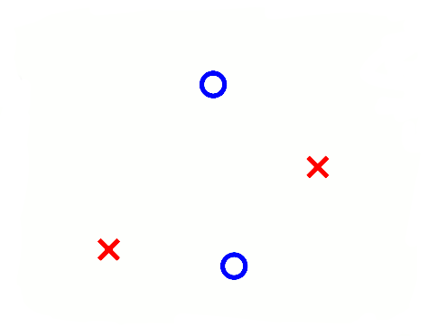

```{r setup, include=FALSE}
knitr::opts_chunk$set(echo = FALSE)
```

When talking about *binary classification*, an *hypothesis* is a function that maps an input from the entire *input space* to a result:
$$
h:\mathcal{X}\to\{-1,+1\}
$$
The number of hypotheses $\vert\mathcal{H}\vert$ can be infinite.

A *dichotomy* is a hypothesis that maps from an input from the *sample size* to a result:

$$
h:\{\mathbf{x}_1,\mathbf{x}_2,\dots,\mathbf{x}_N\}\to\{-1,+1\}
$$

The number of *dichotomies* $\vert\mathcal{H}(\mathbf{x}_1,\mathbf{x}_2,\dots,\mathbf{x}_N )\vert$ is at most $2^N$, where $N$ is the sample size.

e.g. for a sample size $N = 3$ we have at most $8$ possible dichotomies:

```
        x1 x2 x3
1	    -1 -1 -1
2	    -1 -1 +1
3	    -1 +1 -1
4	    -1 +1 +1
5	    +1 -1 -1 
6	    +1 -1 +1
7	    +1 +1 -1
8	    +1 +1 +1

```

The *growth function* is a function that counts the *most* dichotomies on any $N$ points.
$$
m_{\mathcal{H}}(N)=\underset{\mathbf{x}_1,\dots,\mathbf{x}_N\in\mathcal{X}}{max}\vert\mathcal{H}(\mathbf{x}_1,\dots,\mathbf{x}_N)\vert
$$
This translates into choosing any $N$ points and laying them out in *any* fashion in the input space. Determining $m$ is equivalent to looking for such a layout of the $N$ points that yields the *most* dichotomies. 

The growth function satisfies:
$$
m_{\mathcal{H}}(N)\le 2^N
$$
This can be applied to the perceptron. For example, when $N=4$, we can lay out the points so that they are easily separated. However, given a layout, we must then consider all possible configurations of labels on the points, one of which is the following:

<center>
{width=40%}
</center>

This is where the perceptron breaks down because it *cannot* separate that configuration, and so $m_{\mathcal{H}}(4)=14$ because two configurations—this one and the one in which the left/right points are blue and top/bottom are red—cannot be represented. For this reason, we have to expect that for perceptrons, $m$ can’t be $2^4$.

The *VC* ( *Vapnik-Chervonenkis ) dimension* of a hypothesis set $\mathcal{H}$ , denoted by $d_{VC}(\mathcal{H})$ is the largest value of $N$ for which $m_{\mathcal{H}}(N)=2^N$  , in other words is "*the most points $\mathcal{H}$ can shatter* " 

We can say that the *VC* dimension is one of many measures that characterize the expressive power, or capacity, of a hypothesis class. 

You can think of the VC dimension as "how many points can this model class memorize/shatter?" (a ton? $\to$ BAD! not so many? $\to$ GOOD!).  

With respect to learning, the effect of the VC dimension is that if the VC dimension is finite, then the hypothesis will generalize:

$$
d_{vc}(\mathcal H)\ \Longrightarrow\ g \in \mathcal H \text { will generalize }
$$

The key observation here is that this statement is independent of:

- The learning algorithm
- The input distribution
- The target function

The only things that factor into this are the training examples, the hypothesis set, and the final hypothesis.

The VC dimension for a linear classifier (i.e. a *line* in 2D, a *plane* in 3D etc...) is $d+1$ (a line can shatter at most $2+1=3$ points, a plane can shatter at most $3+1=4$ points etc...)

Proof: [here](<http://wittawat.com/posts/vc_dimension_linear_classifier.html>)

How many randomly drawn examples suffice to guarantee error of at most $\epsilon$  with probability at least (1−$\delta$)?

$$
N\ge\frac{1}{\epsilon}\left(4\log\left(\frac{2}{\delta}\right)+8VC(H)\log_2\left(\frac{13}{\epsilon}\right)\right)
$$

*PAC BOUND using VC dimension*:
$$
L_{true}(h)\le L_{train}(h)+\sqrt{\frac{VC(H)\left(\ln\frac{2N}{VC(H)}+1\right)+\ln\frac{4}{\delta}}{N}}
$$


