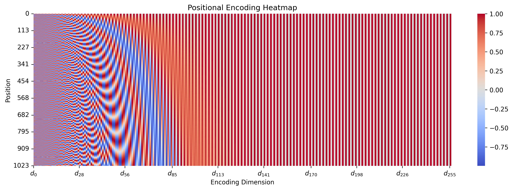
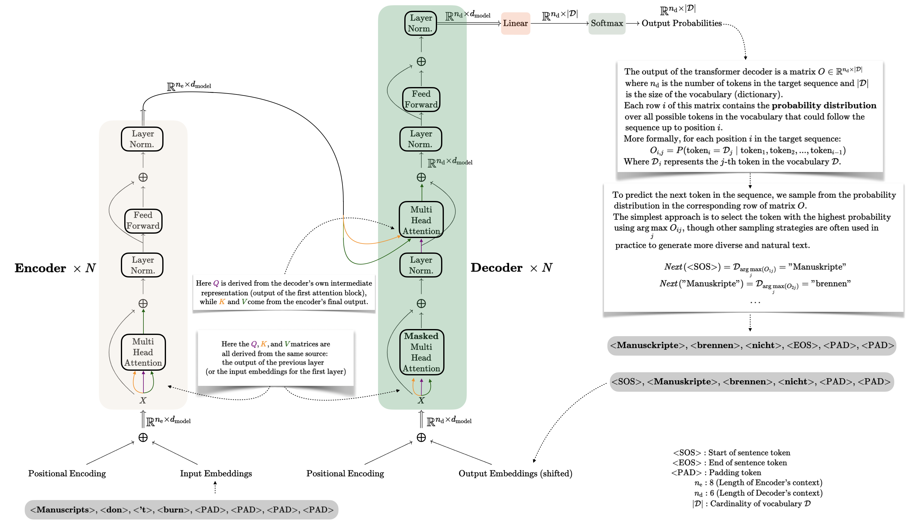

# Introduction

The seminal paper "Attention Is All You Need" by Vaswani et al. quietly revolutionised the world of AI when it appeared in 2017. Little did its authors know they were laying the foundations for the creation of today's Large Language Models, along with AI’s entrance into the mainstream. But before all that chaos, there was just this elegant idea about attention mechanisms that genuinely changed everything.

# Why is this paper important?

The work presented in the paper was initially conceived to find a more efficient and performant solution to the problem of sequence-to-sequence modeling, a machine learning task that involves converting an input sequence into an output sequence, potentially of different lengths. The experiments from the paper presented results for English-to-German and English-to-French translation tasks. The state-of-the-art solutions at the time relied mainly on complex building blocks such as Recurrent Neural Networks and Convolutional Neural Networks, along with attention mechanisms first introduced in the 2014 paper "Neural Machine Translation by Jointly Learning to Align and Translate" (Bahdanau, Cho, and Bengio). The main hypothesis, as the title of the paper states, is that "Attention is all you need," and by introducing a novel architecture called the Transformer, which exclusively leverages highly parallelizable and efficient attention mechanisms, it is possible to achieve state-of-the-art results on machine translation tasks without using recurrence or convolution.

# Background

## Tokenization and Embedding

Before trying to understand the inner workings of the Transformer architecture you should be familiar with a couple of preprocessing operations needed in order to feed text to a neural network. Here we will introduce some lexical terms that you will find all over the literature so, if you are a beginner in the field, take your time to digest this section.

Let’s say we have an input sentence such as “Manuscripts don’t burn.”, this text has to be converted into an input *sequence* composed of multiple tokens, this procedure is called *tokenization*. A token can be a word, or a sub-word, depending on the tokenization technique (Byte-Pair Encoding in this case, but we will not further discuss it in this blog post).

“Manuscripts don’t burn.” → [“Man”, ”uscript”, “s”, “ don”, “'t”, “ burn”]

Here the original text was sub-divided in 6 tokens. We have a fixed number of possible tokens, which represents the cardinality of our *dictionary* $\mathscr{D}$ ( e.g., in the paper a shared vocabulary of 37000 tokens was used for the English-to-German translation experiments, and a shared vocabulary of 32000 tokens was used for the English-to-French translation experiments). Once we have our tokens, we will map each token into a randomly initialised vector $x$ of dimension $d_{\text{model}}$, we call these vectors *embeddings*.

$$
x_{\text{(Man)}},\ x_{\text{(uscript)}},\ x_{\text{(s)}},\ x_{\text{( don)}},\ x_{\text{('t)}},\ x_{\text{( burn)}} \in \mathbb{R}^{d_{\text{model}}}
$$

## Positional Encoding

Given that the Transformer architecture aims to process all tokens in parallel, and these randomly initialized embeddings contain no information regarding the position of the tokens in the sentence (we would like the model to be able to distinguish between "Manuscripts don't burn" and " don't burn Manuscripts"), we add a *positional encoding* vector to each embeddding vector to obtain the final input embeddings.

$$
\textbf{x}_1 = \textbf{x}_{\text{(Man)}}  + \textbf{p}_{1} \\
\textbf{x}_2 = \textbf{x}_{\text{(uscript)}} + \textbf{p}_{2}  \\
\textbf{x}_3 = \textbf{x}_{\text{(s)}} + \textbf{p}_{3}  \\
\textbf{x}_4 = \textbf{x}_{\text{( don)}} + \textbf{p}_{4}  \\
\textbf{x}_5 = \textbf{x}_{\text{('t)}} + \textbf{p}_{5}  \\
\textbf{x}_6 = \textbf{x}_{\text{( burn)}}  + \textbf{p}_{6}
$$

We obtain these positional encoding vectors in the following way:

$$
\textbf{p}_{i} = f(i) \\ \\
f:\mathbb{N}\to\mathbb{R}^{d_{\text{model}}}\\ \\
f(i)_{k}:=
\begin{Bmatrix}
\sin\left(w_k\cdot i\right) \ \ \ \ \text{if $k$ is even}\\
\cos\left(w_k\cdot i\right) \ \ \ \ \text{if $k$ is odd}\ \ 
\end{Bmatrix}\ \
w_k = \frac{1}{10000^{\frac{2k}{d_{\text{model}}}}}
$$

Just for completeness:

$$
\textbf{p}_{i} =
\begin{bmatrix}
\sin\left(w_0\cdot i\right)\\
\cos\left(w_0\cdot i\right)\\
\sin\left(w_1\cdot i\right)\\
\cos\left(w_1\cdot i\right)\\
\cdots \\
\sin\left(w_{d_{\text{model}}/2}\cdot i\right)\\
\cos\left(w_{d_{\text{model}}/2}\cdot i\right)
\end{bmatrix}
$$

Here is a visualization of how these positional embeddings would look like for the first $1024$ embeddings where $d_{\text{model}}=256$

<!-- Include the lightbox2 CSS and JavaScript -->
<head>
  <link href="https://cdnjs.cloudflare.com/ajax/libs/lightbox2/2.11.3/css/lightbox.min.css" rel="stylesheet">
  
</head>

<!-- Image with Lightbox functionality for inline expansion -->

After reading this section you may already have many questions like:

1.  Why are we adding these positional encodings to the randomly initialized embedding vectors instead of concatenating them?
2.  Why was this formulation chosen over other ones? Does it have any desirable properties?
3.  Is this still the chosen method to enforce position information in the input embeddings as today (2025)?

But this would require a separate blog post, so I'm asking you to proceed with this article without questioning the validity of such positional encodings.

# Attention Mechanism

For simplicity, throughout this blog post, we'll assume that each word in a sentence corresponds to a different token. Keep in mind that in practice, tokenization is more complex.

In the following sections, all vectors are represented as lowercase bold and are considered to be column vectors.

## Scaled Dot Product Attention

Let's develop an intuition about the most important building block of the entire architecture: the *scaled dot-product attention* mechanism. This component allows each word embedding to pay attention to surrounding words (its *context*) and update itself to better represent its true semantic meaning.

Consider these two example sentences:

-   "I want to wear my $\color{brown}{\text{cool}}$ jacket"

-   "Today the weather is quite $\color{blue}{\text{cool}}$"

Before training the model the two word-embeddings for the word *cool* would be the same, even though they carry a well distinct meaning. As humans we understand that $\color{brown}{\text{cool}}$ in the first sentence means *"fashionable"*, since it's juxtaposed to the word *"jacket"*; and $\color{blue}{\text{cool}}$ in the second sentence means *"chilly"* since it refers to *"weather"*. So the way we'll formalize this attention mechanism should allow for different words in the sentence to influence each other.

The *"scaled dot-product attention"* presented in the paper takes three input matrices:

-   A *query* matrix $\color{purple}Q$

-   A *key* matrix $\color{darkorange}K$

-   A *value* matrix $\color{darkgreen}V$

These matrices have the following dimensions:

$$
\color{purple}Q\in\mathbb{R}^{n_{\text{tokens}}\times{d_k}}\\
\color{darkorange}K\in\mathbb{R}^{n_{\text{tokens}}\times{d_k}}\\
\color{darkgreen}V\in\mathbb{R}^{n_{\text{tokens}}\times{d_v}}
$$

We'll define $d_k$ and $d_v$ more precisely later, but for now, understand that these represent projections of the original embedding vectors, where $d_k, d_v < d_{\text{model}}$.

### Understanding Q, K, and V Intuitively

To grasp the role of these matrices, think of them as participating in an information exchange system:

-   Each row of the $\color{purple}Q$ matrix contains a query vector $\color{purple}{\mathbf{q}}_i$ for token $i$. This vector represents what information token $i$ is "asking for" from other tokens in the sequence.
-   Each row of the $\color{darkorange}K$ matrix contains a key vector $\color{darkorange}{\mathbf{k}}_j$ for token $j$. This vector represents what information token $j$ can "offer" to other tokens' queries.
-   Each row of the $\color{darkgreen}V$ matrix contains a value vector $\color{darkgreen}{\mathbf{v}}_j$ for token $j$. This vector represents the actual information content that token $j$ contributes when its key matches a query.

The attention mechanism works by computing how relevant each token $j$ is to each token $i$ by measuring the similarity between $\color{purple}{\mathbf{q}}_i$ and $\color{darkorange}{\mathbf{k}}_j$. When this similarity is high, token $i$ will incorporate more of token $j$'s value vector $\color{darkgreen}{\mathbf{v}}_j$ into its contextual representation.

In our example with "cool," the query vector for "cool" in the first sentence might strongly match key vectors from fashion-related words like "jacket," causing its representation to shift toward the "fashionable" meaning. Similarly, in the second sentence, "cool" might match strongly with weather-related words, shifting its representation toward the "chilly" meaning.

### Mathematical Formulation

The attention mechanism produces output representations as follows:

$$
\color{black}{Z}=\text{Attention}(\color{purple}Q,\color{darkorange}K,\color{darkgreen}V) = \text{softmax}\left({\frac{\color{purple}Q\color{darkorange}K^T}{\sqrt{d_k}}}\right)\color{darkgreen}V 
$$

Taking a closer look at the nominator of the softmax argument, we see that it consists of a sort of similarity matrix between the query vectors stored in $\color{purple}Q$ and the key vectors stored in $\color{darkorange}K$

$$
\begin{align}\color{purple}Q\color{darkorange}K^T &=\begin{bmatrix}\mathbf{\color{purple}{q}}^T_{\text{(Today)}} \\\mathbf{\color{purple}{q}}^T_{\text{(the)}} \\\mathbf{\color{purple}{q}}^T_{\text{(weather)}} \\\mathbf{\color{purple}{q}}^T_{\text{(was)}} \\\mathbf{\color{purple}{q}}^T_{\text{(quite)}} \\\mathbf{\color{purple}{q}}^T_{\text{(cool)}} \\\end{bmatrix}\begin{bmatrix}\mathbf{\color{darkorange}{k}}_{\text{(Today)}} &\mathbf{\color{darkorange}{k}}_{\text{(the)}} &\mathbf{\color{darkorange}{k}}_{\text{(weather)}} &\mathbf{\color{darkorange}{k}}_{\text{(was)}} &\mathbf{\color{darkorange}{k}}_{\text{(quite)}} &\mathbf{\color{darkorange}{k}}_{\text{(cool)}} \end{bmatrix} \\ \\\color{purple}Q\color{darkorange}K^T &=\begin{bmatrix}\mathbf{\color{purple}{q}}_{\text{(Today)}}\cdot\mathbf{\color{darkorange}{k}}_{\text{(Today)}} && \mathbf{\color{purple}{q}}_{\text{(Today)}}\cdot\mathbf{\color{darkorange}{k}}_{\text{(the)}} && \mathbf{\color{purple}{q}}_{\text{(Today)}}\cdot\mathbf{\color{darkorange}{k}}_{\text{(weather)}} && \mathbf{\color{purple}{q}}_{\text{(Today)}}\cdot\mathbf{\color{darkorange}{k}}_{\text{(was)}} && \mathbf{\color{purple}{q}}_{\text{(Today)}}\cdot\mathbf{\color{darkorange}{k}}_{\text{(quite)}} && \mathbf{\color{purple}{q}}_{\text{(Today)}}\cdot\mathbf{\color{darkorange}{k}}_{\text{(cool)}} \\\mathbf{\color{purple}{q}}_{\text{(the)}}\cdot\mathbf{\color{darkorange}{k}}_{\text{(Today)}} && \mathbf{\color{purple}{q}}_{\text{(the)}}\cdot\mathbf{\color{darkorange}{k}}_{\text{(the)}} && \mathbf{\color{purple}{q}}_{\text{(the)}}\cdot\mathbf{\color{darkorange}{k}}_{\text{(weather)}} && \mathbf{\color{purple}{q}}_{\text{(the)}}\cdot\mathbf{\color{darkorange}{k}}_{\text{(was)}} && \mathbf{\color{purple}{q}}_{\text{(the)}}\cdot\mathbf{\color{darkorange}{k}}_{\text{(quite)}} && \mathbf{\color{purple}{q}}_{\text{(the)}}\cdot\mathbf{\color{darkorange}{k}}_{\text{(cool)}} \\\mathbf{\color{purple}{q}}_{\text{(weather)}}\cdot\mathbf{\color{darkorange}{k}}_{\text{(Today)}} && \mathbf{\color{purple}{q}}_{\text{(weather)}}\cdot\mathbf{\color{darkorange}{k}}_{\text{(the)}} && \mathbf{\color{purple}{q}}_{\text{(weather)}}\cdot\mathbf{\color{darkorange}{k}}_{\text{(weather)}} && \mathbf{\color{purple}{q}}_{\text{(weather)}}\cdot\mathbf{\color{darkorange}{k}}_{\text{(was)}} && \mathbf{\color{purple}{q}}_{\text{(weather)}}\cdot\mathbf{\color{darkorange}{k}}_{\text{(quite)}} && \mathbf{\color{purple}{q}}_{\text{(weather)}}\cdot\mathbf{\color{darkorange}{k}}_{\text{(cool)}} \\\mathbf{\color{purple}{q}}_{\text{(was)}}\cdot\mathbf{\color{darkorange}{k}}_{\text{(Today)}} && \mathbf{\color{purple}{q}}_{\text{(was)}}\cdot\mathbf{\color{darkorange}{k}}_{\text{(the)}} && \mathbf{\color{purple}{q}}_{\text{(was)}}\cdot\mathbf{\color{darkorange}{k}}_{\text{(weather)}} && \mathbf{\color{purple}{q}}_{\text{(was)}}\cdot\mathbf{\color{darkorange}{k}}_{\text{(was)}} && \mathbf{\color{purple}{q}}_{\text{(was)}}\cdot\mathbf{\color{darkorange}{k}}_{\text{(quite)}} && \mathbf{\color{purple}{q}}_{\text{(was)}}\cdot\mathbf{\color{darkorange}{k}}_{\text{(cool)}} \\\mathbf{\color{purple}{q}}_{\text{(quite)}}\cdot\mathbf{\color{darkorange}{k}}_{\text{(Today)}} && \mathbf{\color{purple}{q}}_{\text{(quite)}}\cdot\mathbf{\color{darkorange}{k}}_{\text{(the)}} && \mathbf{\color{purple}{q}}_{\text{(quite)}}\cdot\mathbf{\color{darkorange}{k}}_{\text{(weather)}} && \mathbf{\color{purple}{q}}_{\text{(quite)}}\cdot\mathbf{\color{darkorange}{k}}_{\text{(was)}} && \mathbf{\color{purple}{q}}_{\text{(quite)}}\cdot\mathbf{\color{darkorange}{k}}_{\text{(quite)}} && \mathbf{\color{purple}{q}}_{\text{(quite)}}\cdot\mathbf{\color{darkorange}{k}}_{\text{(cool)}} \\\mathbf{\color{purple}{q}}_{\text{(cool)}}\cdot\mathbf{\color{darkorange}{k}}_{\text{(Today)}} && \mathbf{\color{purple}{q}}_{\text{(cool)}}\cdot\mathbf{\color{darkorange}{k}}_{\text{(the)}} && \mathbf{\color{purple}{q}}_{\text{(cool)}}\cdot\mathbf{\color{darkorange}{k}}_{\text{(weather)}} && \mathbf{\color{purple}{q}}_{\text{(cool)}}\cdot\mathbf{\color{darkorange}{k}}_{\text{(was)}} && \mathbf{\color{purple}{q}}_{\text{(cool)}}\cdot\mathbf{\color{darkorange}{k}}_{\text{(quite)}} && \mathbf{\color{purple}{q}}_{\text{(cool)}}\cdot\mathbf{\color{darkorange}{k}}_{\text{(cool)}}\end{bmatrix}\end{align}
$$

After normalizing by $\sqrt{d_k}$ and taking the $\text{softmax}$, we see that the output representations stored in $\color{black}{Z}$ are weighted sums of the value vectors.

$$
\color{black}{Z} = \text{softmax}\left({\frac{\color{purple}Q\color{darkorange}K^T}{\sqrt{d_k}}}\right)\color{darkgreen}V =\begin{bmatrix}
0.40 && 
0.10 && 
0.10 && 
0.20 && 
0.10 && 
0.10 \\
0.05 && 
0.40 && 
0.15 && 
0.20 && 
0.10 && 
0.10 \\
0.15 && 
0.20 && 
0.35 && 
0.15 && 
0.05 && 
0.10 \\
0.10 && 
0.05 && 
0.15 &&
0.30 && 
0.15 && 
0.25 \\
0.15 && 
0.10 && 
0.10 &&
0.10 && 
0.35 && 
0.10 \\
0.05 && 
0.05 && 
0.60 &&
0.05 && 
0.05 && 
0.2
\end{bmatrix}\color{green}{
\begin{bmatrix}
\mathbf{v}^T_{\text{(Today)}} \\
\mathbf{v}^T_{\text{(the)}} \\
\mathbf{v}^T_{\text{(weather)}} \\
\mathbf{v}^T_{\text{(was)}} \\
\mathbf{v}^T_{\text{(quite)}} \\
\mathbf{v}^T_{\text{(cool)}} \\
\end{bmatrix}
}
$$

And, as anticipated, the value vector for the word "weather" $\color{green}{\mathbf{v}}^T_{\text{(weather)}}$ will influence the output representation for the word "cool" $\mathbf{z}^T_{\text{(cool)}}$.

$$
\color{black}{
\begin{bmatrix}
\mathbf{z}^T_{\text{(Today)}} \\
\mathbf{z}^T_{\text{(the)}} \\
\mathbf{z}^T_{\text{(weather)}} \\
\mathbf{z}^T_{\text{(was)}} \\
\mathbf{z}^T_{\text{(quite)}} \\
\mathbf{z}^T_{\text{(cool)}} \\
\end{bmatrix}
} =\begin{bmatrix}
\color{rgba(0,135,0,0.8)}{0.40\mathbf{v}^T_{\text{(Today)}}} +
\color{rgba(0,135,0,0.2)}{0.10\mathbf{v}^T_{\text{(the)}}} + 
\color{rgba(0,135,0,0.2)}{0.10\mathbf{v}^T_{\text{(weather)}}} + 
\color{rgba(0,135,0,0.4)}{0.20\mathbf{v}^T_{\text{(was)}}} + 
\color{rgba(0,135,0,0.2)}{0.10\mathbf{v}^T_{\text{(quite)}}} + 
\color{rgba(0,135,0,0.2)}{0.10\mathbf{v}^T_{\text{(cool)}}} \\
\color{rgba(0,135,0,0.1)}{0.05\mathbf{v}^T_{\text{(Today)}}} + 
\color{rgba(0,135,0,0.8)}{0.40\mathbf{v}^T_{\text{(the)}}} + 
\color{rgba(0,135,0,0.3)}{0.15\mathbf{v}^T_{\text{(weather)}}} + 
\color{rgba(0,135,0,0.4)}{0.20\mathbf{v}^T_{\text{(was)}}} + 
\color{rgba(0,135,0,0.2)}{0.10\mathbf{v}^T_{\text{(quite)}}} + 
\color{rgba(0,135,0,0.2)}{0.10\mathbf{v}^T_{\text{(cool)}}} \\
\color{rgba(0,135,0,0.3)}{0.15\mathbf{v}^T_{\text{(Today)}}} +
\color{rgba(0,135,0,0.4)}{0.20\mathbf{v}^T_{\text{(the)}}} + 
\color{rgba(0,135,0,0.7)}{0.35\mathbf{v}^T_{\text{(weather)}}} + 
\color{rgba(0,135,0,0.3)}{0.15\mathbf{v}^T_{\text{(was)}}} + 
\color{rgba(0,135,0,0.1)}{0.05\mathbf{v}^T_{\text{(quite)}}} + 
\color{rgba(0,135,0,0.2)}{0.1\mathbf{v}^T_{\text{(cool)}}} \\
\color{rgba(0,135,0,0.2)}{0.10\mathbf{v}^T_{\text{(Today)}}} +
\color{rgba(0,135,0,0.1)}{0.05\mathbf{v}^T_{\text{(the)}}} + 
\color{rgba(0,135,0,0.3)}{0.15\mathbf{v}^T_{\text{(weather)}}} +
\color{rgba(0,135,0,0.6)}{0.30\mathbf{v}^T_{\text{(was)}}} + 
\color{rgba(0,135,0,0.3)}{0.15\mathbf{v}^T_{\text{(quite)}}} + 
\color{rgba(0,135,0,0.5)}{0.25\mathbf{v}^T_{\text{(cool)}}} \\
\color{rgba(0,135,0,0.3)}{0.15\mathbf{v}^T_{\text{(Today)}}} + 
\color{rgba(0,135,0,0.2)}{0.10\mathbf{v}^T_{\text{(the)}}} + 
\color{rgba(0,135,0,0.2)}{0.10\mathbf{v}^T_{\text{(weather)}}} +
\color{rgba(0,135,0,0.2)}{0.10\mathbf{v}^T_{\text{(was)}}} + 
\color{rgba(0,135,0,0.7)}{0.35\mathbf{v}^T_{\text{(quite)}}} + 
\color{rgba(0,135,0,0.2)}{0.10\mathbf{v}^T_{\text{(cool)}}} \\
\color{rgba(0,135,0,0.1)}{0.05\mathbf{v}^T_{\text{(Today)}}} +
\color{rgba(0,135,0,0.1)}{0.05\mathbf{v}^T_{\text{(the)}}} + 
\color{rgba(0,135,0,1.0)}{\underline{0.60\mathbf{v}^T_{\text{(weather)}}}} +
\color{rgba(0,135,0,0.1)}{0.05\mathbf{v}^T_{\text{(was)}}} + 
\color{rgba(0,135,0,0.1)}{0.05{\mathbf{v}^T_{\text{(quite)}}}} + 
\color{rgba(0,135,0,0.4)}{0.2\mathbf{v}^T_{\text{(cool)}}}
\end{bmatrix}
$$

In case you are wondering the rational behind the denominator of the softmax argument, the authors claim the following:

*--------------------------------------------------------------------------------------------------------------------------------------------*

*We suspect that for large values of* $d_k$*, the dot products grow large in magnitude, pushing the softmax function into regions where it has extremely small gradients. To counteract this effect, we scale the dot products by* $\sqrt{\frac{1}{d_k}}$*. To illustrate why the dot products get large, assume that the components of* $\mathbf{q}$ *and* $\mathbf{k}$ *are independent random variables with mean* $0$ *and variance* $1$*. Then their dot product,* $\mathbf{q}\cdot\mathbf{k} = \sum_{i=1}^{d_k}q_ik_i$*, has mean* $0$ *and variance* $d_k$*.*

*--------------------------------------------------------------------------------------------------------------------------------------------*

## From Input Embeddings to Attention Matrices

Now that we understand how the scaled dot-product attention mechanism works, a natural question arises: how do we obtain the $\color{purple}Q$, $\color{darkorange}K$, and $\color{darkgreen}V$ matrices in the first place?

In the Transformer architecture, these matrices can be derived in different ways depending on whether we're computing ***self-attention*** or ***cross-attention***. For now, let's focus on *self-attention*, as it's conceptually simpler to grasp. We'll introduce *cross-attention* later when discussing the Transformer's encoder and decoder blocks.

### Self-Attention: Same Source, Different Projections

In self-attention, all three matrices $\color{purple}Q$, $\color{darkorange}K$, and $\color{darkgreen}V$ are derived from the **same input sequence**, which corresponds to the *input embeddings*, that gets projected through learned linear transformations:

-   $\color{purple}{W^{Q}}\in\mathbb{R}^{d_{\text{model}}\times{d_k}}$ - Projects input embeddings into *query* space of dimension $d_k$.
-   $\color{darkorange}{W^{K}}\in\mathbb{R}^{d_{\text{model}}\times{d_k}}$ - Projects input embeddings into *key* space of dimension $d_k$.
-   $\color{darkgreen}{W^{V}}\in\mathbb{R}^{d_{\text{model}}\times{d_v}}$ - Projects input embeddings into *value* space of dimension $d_v$.

Note that the query and key spaces intentionally share the same dimensionality ($d_k$). This is because we compute dot products between queries and keys, which requires matching dimensions. The dimensionality of the values $d_v$ can be different even though it's common to have $d_v=d_k$.

### Mathematical Formulation

If we denote our input embeddings as matrix $X \in \mathbb{R}^{n_{\text{tokens}} \times d_{\text{model}}}$, where $n_{\text{tokens}}$ is the sequence length and $d_{\text{model}}$ is the embedding dimension, then:

$$
\color{purple}Q = X\color{purple}{W^Q} \\
\color{darkorange}K = X\color{darkorange}{W^K} \\
\color{darkgreen}V = X\color{darkgreen}{W^V}
$$

With these projections, each token in our sequence now has corresponding query, key, and value vectors. These are then used in the scaled dot-product attention formula we covered earlier.

## Multi-Head Attention

 The authors of the paper take the scaled dot-product attention concept a step further with *Multi-Head Attention*, which allows the model to jointly attend to information from different representation subspaces.

In Multi-Head Attention, instead of performing a single attention function, the model performs attention multiple times in parallel. Each of these parallel attention operations is called a "head", and each head learns to focus on different aspects of the relationships between tokens.

For each head $i$ from a total of $h$ heads, we create separate projection matrices:

-   $\color{purple}{W^{Q}_\color{black}i}\in\mathbb{R}^{d_{\text{model}}\times{d_k}}$ - Projects input embeddings into *query* space.

-   $\color{darkorange}{W^{K}_\color{black}i}\in\mathbb{R}^{d_{\text{model}}\times{d_k}}$ - Projects input embeddings into *key* space.

-   $\color{darkgreen}{W^{V}_\color{black}i}\in\mathbb{R}^{d_{\text{model}}\times{d_v}}$ - Projects input embeddings into *value* space.

### Mathematical Formulation

Denoting again our input token embeddings as matrix $X \in \mathbb{R}^{n_{\text{tokens}} \times d_{\text{model}}}$. For each attention head $i$, we compute:

$$
\color{purple}Q_i = X\color{purple}{W^Q_{\color{black}i}} \\
\color{darkorange}K_i = X\color{darkorange}{W^K_{\color{black}i}} \\
\color{darkgreen}V_i = X\color{darkgreen}{W^V_{\color{black}i}}
$$

Then, we apply the Scaled Dot Product attention to each head independently:

$$
\text{head}_i = \text{Attention}(\color{purple}Q_i, \color{darkorange}K_i, \color{darkgreen}V_i) = \text{softmax}\left(\frac{\color{purple}Q_i\color{darkorange}K_i^T}{\sqrt{d_k}}\right)\color{darkgreen}V_i
$$

The outputs from each head are concatenated and then projected once more using a final output projection matrix $W^O \in \mathbb{R}^{hd_v \times d_{\text{model}}}$:

$$
\text{MultiHead}(X) = \text{Concat}(\text{head}_1, \text{head}_2, \ldots, \text{head}_h)W^O
$$

### Why Multiple Heads?

Multiple attention heads allow the model to capture different types of relationships simultaneously:

1.  Some heads might focus on local relationships between adjacent words.

2.  Others might capture long-distance dependencies.

3.  Some might attend to syntactic relationships, while others focus on semantic meaning.

Generally speaking, this approach helps the model build richer representations of the input text.

In practice, the paper uses $h = 8$ parallel attention heads for the encoder and decoder layers, with $d_k = d_v = d_{\text{model}}/h = 64$.

# Layer Normalization

Layer Normalization is another crucial component of the Transformer architecture that helps stabilize and accelerate training. Unlike Batch Normalization, which normalizes across the batch dimension, LayerNorm operates on the feature dimension for each individual sample.

## Mathematical Formulation

For an input vector $\mathbf{x} \in \mathbb{R}^{d_{\text{model}}}$ (representing a single token's embedding), LayerNorm applies the following transformation:

$$
\text{LayerNorm}(\mathbf{x}) = \gamma \odot \frac{\mathbf{x} - \mu}{\sqrt{\sigma^2 + \epsilon}} + \beta
$$

Where:
 
- $\mu = \frac{1}{d_{\text{model}}} \sum_{i=1}^{d_{\text{model}}} x_i$ is the mean of the features

- $\sigma^2 = \frac{1}{d_{\text{model}}} \sum_{i=1}^{d_{\text{model}}} (x_i - \mu)^2$ is the variance of the features

- $\epsilon$ is a small constant added for numerical stability

- $\gamma, \beta \in \mathbb{R}^{d_{\text{model}}}$ are learnable parameters (scale and shift)

- $\odot$ denotes element-wise multiplication

When applied to a matrix of token embeddings $X \in \mathbb{R}^{n_{\text{tokens}} \times d_{\text{model}}}$, LayerNorm processes each row independently, normalizing across the embedding dimension.

The main purpose of Layer Normalization is to prevent exploding or vanishing gradients by ensuring that the input to each sub-layer of the full transformer architecture has consistent statistical properties (that allow for faster convergence as well!).

# Feed Forward Layer

The last building block that will help us compose the whole Transformer architecture is the Position-wise Feed Forward Network (FFN). Despite its simplicity, this component contributes significantly to the model's expressive power.

## Mathematical Formulation

The Feed Forward Network consists of two linear transformations with a ReLU activation in between:

$$
\text{FFN}(\mathbf{x}) = \max(0, \mathbf{x}W_1 + b_1)W_2 + b_2
$$

Where:

- $\mathbf{x} \in \mathbb{R}^{d_{\text{model}}}$ is the input vector for a single token

- $W_1 \in \mathbb{R}^{d_{\text{model}} \times d_{\text{ff}}}$ and $W_2 \in \mathbb{R}^{d_{\text{ff}} \times d_{\text{model}}}$ are weight matrices

- $b_1 \in \mathbb{R}^{d_{\text{ff}}}$ and $b_2 \in \mathbb{R}^{d_{\text{model}}}$ are bias vectors

- $d_{\text{ff}}$ is the inner dimension of the feed-forward network (typically 4 times larger than $d_{\text{model}}$)

Crucially, this FFN is applied to each position (token) separately and identically - hence "position-wise". When working with a sequence of tokens represented as a matrix $X \in \mathbb{R}^{n_{\text{tokens}} \times d_{\text{model}}}$, the FFN processes each row independently, using the same set of parameters $W_1, b_1, W_2, b_2$.

The Position-wise FFN serves mainly to introduce non-linearity through the ReLU activation, increasing the model's capacity to learn complex functions.

In the paper, the authors use $d_{\text{ff}} = 2048$ with $d_{\text{model}} = 512$, creating a significant expansion in the intermediate representation.

# Complete Transformer Architecture

Now that we have a grasp of how the Multi Head Attention, Layer Normalization, and Feed Forward Network blocks work, we can visualize the full Transformer architecture, composed of both an *encoder* and a *decoder* block. In the context of neural machine translation, the encoder's responsibility is to extract information from the original language (e.g., English) sentence, while the decoder has to predict the words (tokens) that will compose the sentence in the target language (e.g., German). We'll use as an example the following English to German sentence pair:

$$
\text{Manuscripts don't burn}\to\text{Manuskripte brennen nicht}
$$

Here is an illustration that depicts the flow of information from the encoder to the decoder during ***training***: (Click on the image to enlarge it if you are reading from the browser)

<!-- Include the lightbox2 CSS and JavaScript -->
<head>
  <link href="https://cdnjs.cloudflare.com/ajax/libs/lightbox2/2.11.3/css/lightbox.min.css" rel="stylesheet">
  
</head>

<!-- Image with Lightbox functionality for inline expansion -->

## Encoder Structure

The encoder is composed of a stack of $N = 6$ identical layers. Each layer has two sub-layers:

1.  A *multi-head self-attention* mechanism, where $\color{purple}Q$, $\color{darkorange}K$, and $\color{darkgreen}V$ are all derived from the output of the previous layer (or input embeddings for the first layer)

2.  A *position-wise fully connected feed-forward network*

We employ a residual connection around each of the two sub-layers, followed by layer normalization. That is, the output of each sub-layer is $\text{LayerNorm}(x + \text{Sublayer}(x))$, where $\text{Sublayer}(x)$ is the function implemented by the sub-layer itself. To facilitate these residual connections, all sub-layers in the model, as well as the embedding layers, produce outputs of dimension $d_{\text{model}} = 512$.

### Encoder Input during Training

The encoder processes a sequence of tokens with a fixed maximum length, known as the encoder's context length. This parameter defines the upper limit of input tokens the model can handle in a single forward pass. In our toy example, we set this context length to $n_e=8$, while the original Transformer paper implementation uses $n_e=512$ (as seen in the official TensorFlow implementation).
The context length should be chosen to accommodate the longest input sequences expected in your dataset. For sequences shorter than the context length, a special padding token "\<PAD\>" is added to fill the remaining positions. These padding tokens are typically masked out in the attention mechanism to prevent them from influencing the representations of actual content tokens.

How does this masking happen in practice? Coming back to our example we may have the following "similarity" matrix between the $\color{purple}Q$uery and $\color{darkorange}K$ey vectors from the encoder: 

$$
\begin{align}
\color{purple}Q\color{darkorange}K^T &=
\begin{bmatrix}\mathbf{\color{purple}{q}}^T_{\text{(Manuscripts)}} \\
\mathbf{\color{purple}{q}}^T_{\text{(don)}} \\
\mathbf{\color{purple}{q}}^T_{\text{('t)}} \\
\mathbf{\color{purple}{q}}^T_{\text{(burn)}} \\
\mathbf{\color{gray}{q}}^T_{\text{(PAD)}} \\
\mathbf{\color{gray}{q}}^T_{\text{(PAD)}} \\
\mathbf{\color{gray}{q}}^T_{\text{(PAD)}} \\
\mathbf{\color{gray}{q}}^T_{\text{(PAD)}}
\end{bmatrix}
\begin{bmatrix}
\mathbf{\color{darkorange}{k}}_{\text{(Manuscripts)}} &
\mathbf{\color{darkorange}{k}}_{\text{(don)}} &
\mathbf{\color{darkorange}{k}}_{\text{('t)}} &
\mathbf{\color{darkorange}{k}}_{\text{(burn)}} &
\mathbf{\color{gray}{k}}_{\text{(PAD)}} &
\mathbf{\color{gray}{k}}_{\text{(PAD)}} &
\mathbf{\color{gray}{k}}_{\text{(PAD)}} &
\mathbf{\color{gray}{k}}_{\text{(PAD)}}
\end{bmatrix}\\
\color{purple}Q\color{darkorange}K^T &=\begin{bmatrix}
\mathbf{\color{purple}{q}}_{\text{Manuscripts}}\cdot\mathbf{\color{darkorange}{k}}_{\text{Manuscripts}} & \mathbf{\color{purple}{q}}_{\text{Manuscripts}}\cdot\mathbf{\color{darkorange}{k}}_{\text{don}} & \mathbf{\color{purple}{q}}_{\text{Manuscripts}}\cdot\mathbf{\color{darkorange}{k}}_{\text{'t}} & \mathbf{\color{purple}{q}}_{\text{Manuscripts}}\cdot\mathbf{\color{darkorange}{k}}_{\text{burn}} & \mathbf{\color{purple}{q}}_{\text{Manuscripts}}\cdot\mathbf{\color{gray}{k}}_{\text{PAD}} & \color{gray}\cdots \\
\mathbf{\color{purple}{q}}_{\text{don}}\cdot\mathbf{\color{darkorange}{k}}_{\text{Manuscripts}} & \mathbf{\color{purple}{q}}_{\text{don}}\cdot\mathbf{\color{darkorange}{k}}_{\text{don}} & \mathbf{\color{purple}{q}}_{\text{don}}\cdot\mathbf{\color{darkorange}{k}}_{\text{'t}} & \mathbf{\color{purple}{q}}_{\text{don}}\cdot\mathbf{\color{darkorange}{k}}_{\text{burn}} & \mathbf{\color{purple}{q}}_{\text{don}}\cdot\mathbf{\color{gray}{k}}_{\text{PAD}} & \color{gray}\cdots  \\
\mathbf{\color{purple}{q}}_{\text{'t}}\cdot\mathbf{\color{darkorange}{k}}_{\text{Manuscripts}} & \mathbf{\color{purple}{q}}_{\text{'t}}\cdot\mathbf{\color{darkorange}{k}}_{\text{don}} & \mathbf{\color{purple}{q}}_{\text{'t}}\cdot\mathbf{\color{darkorange}{k}}_{\text{'t}} & \mathbf{\color{purple}{q}}_{\text{'t}}\cdot\mathbf{\color{darkorange}{k}}_{\text{burn}} & \mathbf{\color{purple}{q}}_{\text{'t}}\cdot\mathbf{\color{gray}{k}}_{\text{PAD}} & \color{gray}\cdots \\
\mathbf{\color{purple}{q}}_{\text{burn}}\cdot\mathbf{\color{darkorange}{k}}_{\text{Manuscripts}} & \mathbf{\color{purple}{q}}_{\text{burn}}\cdot\mathbf{\color{darkorange}{k}}_{\text{don}} & \mathbf{\color{purple}{q}}_{\text{burn}}\cdot\mathbf{\color{darkorange}{k}}_{\text{'t}} & \mathbf{\color{purple}{q}}_{\text{burn}}\cdot\mathbf{\color{darkorange}{k}}_{\text{burn}} & \mathbf{\color{purple}{q}}_{\text{burn}}\cdot\mathbf{\color{gray}{k}}_{\text{PAD}} & \color{gray}\cdots \\
\mathbf{\color{gray}{q}}_{\text{PAD}}\cdot\mathbf{\color{darkorange}{k}}_{\text{Manuscripts}} & \mathbf{\color{gray}{q}}_{\text{PAD}}\cdot\mathbf{\color{darkorange}{k}}_{\text{don}} & \mathbf{\color{gray}{q}}_{\text{PAD}}\cdot\mathbf{\color{darkorange}{k}}_{\text{'t}} & \mathbf{\color{gray}{q}}_{\text{PAD}}\cdot\mathbf{\color{darkorange}{k}}_{\text{burn}} & \mathbf{\color{gray}{q}}_{\text{PAD}}\cdot\mathbf{\color{gray}{k}}_{\text{PAD}} & \color{gray}\cdots \\
\color{gray}\vdots & \color{gray}\vdots & \color{gray}\vdots & \color{gray}\vdots & \color{gray}\vdots & \color{gray}\ddots  \\
\end{bmatrix}
\end{align}
$$

Since the dot products that contain any "\<PAD\>" token shouldn't influence the final output representations we add a padding mask $M_{\text{pad}}$ to ensure padded tokens don't influence the final attention output:

$$
M_{\text{pad}} = 
\begin{bmatrix}
0 & 0 & 0 & 0 & -\infty & -\infty & -\infty & -\infty \\
0 & 0 & 0 & 0 & -\infty & -\infty & -\infty & -\infty \\
0 & 0 & 0 & 0 & -\infty & -\infty & -\infty & -\infty \\
0 & 0 & 0 & 0 & -\infty & -\infty & -\infty & -\infty \\
-\infty & -\infty & -\infty & -\infty & -\infty & -\infty & -\infty & -\infty \\
-\infty & -\infty & -\infty & -\infty & -\infty & -\infty & -\infty & -\infty \\
-\infty & -\infty & -\infty & -\infty & -\infty & -\infty & -\infty & -\infty \\
-\infty & -\infty & -\infty & -\infty & -\infty & -\infty & -\infty & -\infty
\end{bmatrix}
$$

The final attention output with padding mask applied will then look like this:

$$
\color{black}{Z} = \text{softmax}\left({\frac{\color{purple}Q\color{darkorange}K^T}{\sqrt{d_k}}+M_\text{pad}}\right)\color{darkgreen}V =
$$

If you need a refresher on the *softmax* function to understand why $-\infty$ terms will map to $0$ (and have null contribution) here it is:

$$
\text{softmax}(x_i) = \frac{e^{x_i}}{\sum_{j=1}^{n_e}e^{x_j}} 
$$

### Encoder Input during Inference

Same as in ***training***.

## Decoder Structure

The decoder is also composed of a stack of $N = 6$ identical layers. However, each decoder layer has three sub-layers instead of two:

1.  A *masked multi-head self-attention* mechanism, where $\color{purple}Q$, $\color{darkorange}K$, and $\color{darkgreen}V$ all come from the decoder's previous layer output (or input embeddings for the first layer). The masking ensures that predictions for a position can only depend on known outputs at earlier positions (read the sub-section below for more details)

2.  A *multi-head cross-attention* mechanism, where $\color{purple}Q$ comes from the output of the decoder's first sub-layer, while $\color{darkorange}K$ and $\color{darkgreen}V$ come from the encoder's output. This allows the decoder to focus on relevant parts of the input sequence.

3.  A *position-wise fully connected feed-forward network* analogous to the one in the encoder.

As in the encoder, we apply residual connections around each sub-layer followed by layer normalization.

### Decoder Input during Training
The decoder takes as input the right-shifted target sequence (we add a "\<SOS\>" - Start Of Sentence - token at the beginning of the sequence). In our example, the decoder input sequence is `["<SOS>", "Manuskripte", "brennen", "nicht", "<PAD>", "<PAD>"]`, where we've padded to match our context length $n_d=6$.

**Why right-shift the input?** This right-shifting is crucial during training because of how the decoder learns to generate text. The decoder's job is to predict the next token in the sequence based on what came before.

During training, we need to:

1. Give the decoder the tokens it should have predicted so far (to learn from)

2. Ask it to predict the next token in the sequence

3. Compare its prediction with the actual next token

Without right-shifting, the decoder would see the token it's trying to predict! By shifting the target sequence right (adding a start token at the beginning), each position in the decoder can only attend to previous tokens, preserving the causal nature of language generation. This means at position 1, the decoder sees ["\<SOS\>"] and must predict "Manuskripte", at position 2, the decoder sees ["\<SOS\>", "Manuskripte"] and must predict "brennen" - and so on...

#### Masked self-attention

For the decoder's self-attention, we need to apply both:

1. A padding mask (similar to the encoder) to ignore padded tokens

2. A causal mask to prevent tokens from attending to future positions

Let's first visualize the "similarity" matrix between $\color{purple}Q$uery and $\color{darkorange}K$ey vectors in the decoder's self-attention:

$$
\begin{align}
\color{purple}Q\color{darkorange}K^T &=
\begin{bmatrix}\mathbf{\color{purple}{q}}^T_{\text{(SOS)}} \\
\mathbf{\color{purple}{q}}^T_{\text{(Manuskripte)}} \\
\mathbf{\color{purple}{q}}^T_{\text{(brennen)}} \\
\mathbf{\color{purple}{q}}^T_{\text{(nicht)}} \\
\mathbf{\color{gray}{q}}^T_{\text{(PAD)}} \\
\mathbf{\color{gray}{q}}^T_{\text{(PAD)}}
\end{bmatrix}
\begin{bmatrix}
\mathbf{\color{darkorange}{k}}_{\text{(SOS)}} &
\mathbf{\color{darkorange}{k}}_{\text{(Manuskripte)}} &
\mathbf{\color{darkorange}{k}}_{\text{(brennen)}} &
\mathbf{\color{darkorange}{k}}_{\text{(nicht)}} &
\mathbf{\color{gray}{k}}_{\text{(PAD)}} &
\mathbf{\color{gray}{k}}_{\text{(PAD)}}
\end{bmatrix}\\
\color{purple}Q\color{darkorange}K^T &=\begin{bmatrix}
\mathbf{\color{purple}{q}}_{\text{SOS}}\cdot\mathbf{\color{darkorange}{k}}_{\text{SOS}} & \mathbf{\color{purple}{q}}_{\text{SOS}}\cdot\mathbf{\color{darkorange}{k}}_{\text{Manuskripte}} & \mathbf{\color{purple}{q}}_{\text{SOS}}\cdot\mathbf{\color{darkorange}{k}}_{\text{brennen}} & \mathbf{\color{purple}{q}}_{\text{SOS}}\cdot\mathbf{\color{darkorange}{k}}_{\text{nicht}} & \mathbf{\color{purple}{q}}_{\text{SOS}}\cdot\mathbf{\color{gray}{k}}_{\text{PAD}} & \mathbf{\color{purple}{q}}_{\text{SOS}}\cdot\mathbf{\color{gray}{k}}_{\text{PAD}} \\
\mathbf{\color{purple}{q}}_{\text{Manuskripte}}\cdot\mathbf{\color{darkorange}{k}}_{\text{SOS}} & \mathbf{\color{purple}{q}}_{\text{Manuskripte}}\cdot\mathbf{\color{darkorange}{k}}_{\text{Manuskripte}} & \mathbf{\color{purple}{q}}_{\text{Manuskripte}}\cdot\mathbf{\color{darkorange}{k}}_{\text{brennen}} & \mathbf{\color{purple}{q}}_{\text{Manuskripte}}\cdot\mathbf{\color{darkorange}{k}}_{\text{nicht}} & \mathbf{\color{purple}{q}}_{\text{Manuskripte}}\cdot\mathbf{\color{gray}{k}}_{\text{PAD}} & \mathbf{\color{purple}{q}}_{\text{Manuskripte}}\cdot\mathbf{\color{gray}{k}}_{\text{PAD}} \\
\mathbf{\color{purple}{q}}_{\text{brennen}}\cdot\mathbf{\color{darkorange}{k}}_{\text{SOS}} & \mathbf{\color{purple}{q}}_{\text{brennen}}\cdot\mathbf{\color{darkorange}{k}}_{\text{Manuskripte}} & \mathbf{\color{purple}{q}}_{\text{brennen}}\cdot\mathbf{\color{darkorange}{k}}_{\text{brennen}} & \mathbf{\color{purple}{q}}_{\text{brennen}}\cdot\mathbf{\color{darkorange}{k}}_{\text{nicht}} & \mathbf{\color{purple}{q}}_{\text{brennen}}\cdot\mathbf{\color{gray}{k}}_{\text{PAD}} & \mathbf{\color{purple}{q}}_{\text{brennen}}\cdot\mathbf{\color{gray}{k}}_{\text{PAD}} \\
\mathbf{\color{purple}{q}}_{\text{nicht}}\cdot\mathbf{\color{darkorange}{k}}_{\text{SOS}} & \mathbf{\color{purple}{q}}_{\text{nicht}}\cdot\mathbf{\color{darkorange}{k}}_{\text{Manuskripte}} & \mathbf{\color{purple}{q}}_{\text{nicht}}\cdot\mathbf{\color{darkorange}{k}}_{\text{brennen}} & \mathbf{\color{purple}{q}}_{\text{nicht}}\cdot\mathbf{\color{darkorange}{k}}_{\text{nicht}} & \mathbf{\color{purple}{q}}_{\text{nicht}}\cdot\mathbf{\color{gray}{k}}_{\text{PAD}} & \mathbf{\color{purple}{q}}_{\text{nicht}}\cdot\mathbf{\color{gray}{k}}_{\text{PAD}} \\
\mathbf{\color{gray}{q}}_{\text{PAD}}\cdot\mathbf{\color{darkorange}{k}}_{\text{SOS}} & \mathbf{\color{gray}{q}}_{\text{PAD}}\cdot\mathbf{\color{darkorange}{k}}_{\text{Manuskripte}} & \mathbf{\color{gray}{q}}_{\text{PAD}}\cdot\mathbf{\color{darkorange}{k}}_{\text{brennen}} & \mathbf{\color{gray}{q}}_{\text{PAD}}\cdot\mathbf{\color{darkorange}{k}}_{\text{nicht}} & \mathbf{\color{gray}{q}}_{\text{PAD}}\cdot\mathbf{\color{gray}{k}}_{\text{PAD}} & \mathbf{\color{gray}{q}}_{\text{PAD}}\cdot\mathbf{\color{gray}{k}}_{\text{PAD}} \\
\mathbf{\color{gray}{q}}_{\text{PAD}}\cdot\mathbf{\color{darkorange}{k}}_{\text{SOS}} & \mathbf{\color{gray}{q}}_{\text{PAD}}\cdot\mathbf{\color{darkorange}{k}}_{\text{Manuskripte}} & \mathbf{\color{gray}{q}}_{\text{PAD}}\cdot\mathbf{\color{darkorange}{k}}_{\text{brennen}} & \mathbf{\color{gray}{q}}_{\text{PAD}}\cdot\mathbf{\color{darkorange}{k}}_{\text{nicht}} & \mathbf{\color{gray}{q}}_{\text{PAD}}\cdot\mathbf{\color{gray}{k}}_{\text{PAD}} & \mathbf{\color{gray}{q}}_{\text{PAD}}\cdot\mathbf{\color{gray}{k}}_{\text{PAD}}
\end{bmatrix}
\end{align}
$$

Now, we need to apply two masks:

First, the causal mask $M_{\text{causal}}$ ensures that tokens only attend to previous positions:

$$
M_{\text{causal}} = 
\begin{bmatrix}
0 & -\infty & -\infty & -\infty & -\infty & -\infty \\
0 & 0 & -\infty & -\infty & -\infty & -\infty \\
0 & 0 & 0 & -\infty & -\infty & -\infty \\
0 & 0 & 0 & 0 & -\infty & -\infty \\
0 & 0 & 0 & 0 & 0 & -\infty \\
0 & 0 & 0 & 0 & 0 & 0
\end{bmatrix}
$$

Second, the padding mask $M_{\text{pad}}$ prevents attention to and from padding tokens:

$$
M_{\text{pad}} = 
\begin{bmatrix}
0 & 0 & 0 & 0 & -\infty & -\infty \\
0 & 0 & 0 & 0 & -\infty & -\infty \\
0 & 0 & 0 & 0 & -\infty & -\infty \\
0 & 0 & 0 & 0 & -\infty & -\infty \\
-\infty & -\infty & -\infty & -\infty & -\infty & -\infty \\
-\infty & -\infty & -\infty & -\infty & -\infty & -\infty
\end{bmatrix}
$$

The combined mask $M_{\text{combined}} = M_{\text{causal}} + M_{\text{pad}}$ is then:

$$
M_{\text{combined}} = 
\begin{bmatrix}
0 & -\infty & -\infty & -\infty & -\infty & -\infty \\
0 & 0 & -\infty & -\infty & -\infty & -\infty \\
0 & 0 & 0 & -\infty & -\infty & -\infty \\
0 & 0 & 0 & 0 & -\infty & -\infty \\
-\infty & -\infty & -\infty & -\infty & -\infty & -\infty \\
-\infty & -\infty & -\infty & -\infty & -\infty & -\infty
\end{bmatrix}
$$

The final attention output with both masks applied will then look like:

$$
\color{black}{Z} = \text{softmax}\left({\frac{\color{purple}Q\color{darkorange}K^T}{\sqrt{d_k}}+M_\text{combined}}\right)\color{darkgreen}V
$$

#### Cross-attention

The cross-attention mechanism allows the decoder to focus on relevant parts of the encoder's output while generating each token. Unlike the decoder's self-attention, cross-attention does not require causal masking because the entire source sequence is already available. 
In our example, the decoder input `["<SOS>", "Manuskripte", "brennen", "nicht", "<PAD>", "<PAD>"]` needs to attend to the encoder output for `["Manuscripts", "don", "'t", "burn", "<PAD>", "<PAD>", "<PAD>", "<PAD>"]`.

In cross-attention, the $\color{purple}Q$ueries come from the decoder, while the $\color{darkorange}K$eys and $\color{darkgreen}V$alues come from the encoder. This enables each decoder position to attend to all encoder positions:

$$
\begin{align}
\color{purple}Q\color{darkorange}K^T &=
\begin{bmatrix}\mathbf{\color{purple}{q}}^T_{\text{(SOS)}} \\
\mathbf{\color{purple}{q}}^T_{\text{(Manuskripte)}} \\
\mathbf{\color{purple}{q}}^T_{\text{(brennen)}} \\
\mathbf{\color{purple}{q}}^T_{\text{(nicht)}} \\
\mathbf{\color{gray}{q}}^T_{\text{(PAD)}} \\
\mathbf{\color{gray}{q}}^T_{\text{(PAD)}}
\end{bmatrix}
\begin{bmatrix}
\mathbf{\color{darkorange}{k}}_{\text{(Manuscripts)}} &
\mathbf{\color{darkorange}{k}}_{\text{(don)}} &
\mathbf{\color{darkorange}{k}}_{\text{('t)}} &
\mathbf{\color{darkorange}{k}}_{\text{(burn)}} &
\mathbf{\color{gray}{k}}_{\text{(PAD)}} & \mathbf{\color{gray}{k}}_{\text{(PAD)}} & \mathbf{\color{gray}{k}}_{\text{(PAD)}} & \mathbf{\color{gray}{k}}_{\text{(PAD)}}
\end{bmatrix}\\
\color{purple}Q\color{darkorange}K^T &=\begin{bmatrix}
\mathbf{\color{purple}{q}}_{\text{SOS}}\cdot\mathbf{\color{darkorange}{k}}_{\text{Manuscripts}} & \mathbf{\color{purple}{q}}_{\text{SOS}}\cdot\mathbf{\color{darkorange}{k}}_{\text{don}} & \mathbf{\color{purple}{q}}_{\text{SOS}}\cdot\mathbf{\color{darkorange}{k}}_{\text{'t}} & \mathbf{\color{purple}{q}}_{\text{SOS}}\cdot\mathbf{\color{darkorange}{k}}_{\text{burn}} & \mathbf{\color{purple}{q}}_{\text{SOS}}\cdot\mathbf{\color{gray}{k}}_{\text{PAD}} & \mathbf{\color{purple}{q}}_{\text{SOS}}\cdot\mathbf{\color{gray}{k}}_{\text{PAD}} & \mathbf{\color{purple}{q}}_{\text{SOS}}\cdot\mathbf{\color{gray}{k}}_{\text{PAD}} & \mathbf{\color{purple}{q}}_{\text{SOS}}\cdot\mathbf{\color{gray}{k}}_{\text{PAD}} \\
\mathbf{\color{purple}{q}}_{\text{Manuskripte}}\cdot\mathbf{\color{darkorange}{k}}_{\text{Manuscripts}} & \mathbf{\color{purple}{q}}_{\text{Manuskripte}}\cdot\mathbf{\color{darkorange}{k}}_{\text{don}} & \mathbf{\color{purple}{q}}_{\text{Manuskripte}}\cdot\mathbf{\color{darkorange}{k}}_{\text{'t}} & \mathbf{\color{purple}{q}}_{\text{Manuskripte}}\cdot\mathbf{\color{darkorange}{k}}_{\text{burn}} & \mathbf{\color{purple}{q}}_{\text{Manuskripte}}\cdot\mathbf{\color{gray}{k}}_{\text{PAD}} & \mathbf{\color{purple}{q}}_{\text{Manuskripte}}\cdot\mathbf{\color{gray}{k}}_{\text{PAD}} & \mathbf{\color{purple}{q}}_{\text{Manuskripte}}\cdot\mathbf{\color{gray}{k}}_{\text{PAD}} & \mathbf{\color{purple}{q}}_{\text{Manuskripte}}\cdot\mathbf{\color{gray}{k}}_{\text{PAD}} \\
\mathbf{\color{purple}{q}}_{\text{brennen}}\cdot\mathbf{\color{darkorange}{k}}_{\text{Manuscripts}} & \mathbf{\color{purple}{q}}_{\text{brennen}}\cdot\mathbf{\color{darkorange}{k}}_{\text{don}} & \mathbf{\color{purple}{q}}_{\text{brennen}}\cdot\mathbf{\color{darkorange}{k}}_{\text{'t}} & \mathbf{\color{purple}{q}}_{\text{brennen}}\cdot\mathbf{\color{darkorange}{k}}_{\text{burn}} & \mathbf{\color{purple}{q}}_{\text{brennen}}\cdot\mathbf{\color{gray}{k}}_{\text{PAD}} & \mathbf{\color{purple}{q}}_{\text{brennen}}\cdot\mathbf{\color{gray}{k}}_{\text{PAD}} & \mathbf{\color{purple}{q}}_{\text{brennen}}\cdot\mathbf{\color{gray}{k}}_{\text{PAD}} & \mathbf{\color{purple}{q}}_{\text{brennen}}\cdot\mathbf{\color{gray}{k}}_{\text{PAD}} \\
\mathbf{\color{purple}{q}}_{\text{nicht}}\cdot\mathbf{\color{darkorange}{k}}_{\text{Manuscripts}} & \mathbf{\color{purple}{q}}_{\text{nicht}}\cdot\mathbf{\color{darkorange}{k}}_{\text{don}} & \mathbf{\color{purple}{q}}_{\text{nicht}}\cdot\mathbf{\color{darkorange}{k}}_{\text{'t}} & \mathbf{\color{purple}{q}}_{\text{nicht}}\cdot\mathbf{\color{darkorange}{k}}_{\text{burn}} & \mathbf{\color{purple}{q}}_{\text{nicht}}\cdot\mathbf{\color{gray}{k}}_{\text{PAD}} & \mathbf{\color{purple}{q}}_{\text{nicht}}\cdot\mathbf{\color{gray}{k}}_{\text{PAD}} & \mathbf{\color{purple}{q}}_{\text{nicht}}\cdot\mathbf{\color{gray}{k}}_{\text{PAD}} & \mathbf{\color{purple}{q}}_{\text{nicht}}\cdot\mathbf{\color{gray}{k}}_{\text{PAD}} \\
\mathbf{\color{gray}{q}}_{\text{PAD}}\cdot\mathbf{\color{darkorange}{k}}_{\text{Manuscripts}} & \mathbf{\color{gray}{q}}_{\text{PAD}}\cdot\mathbf{\color{darkorange}{k}}_{\text{don}} & \mathbf{\color{gray}{q}}_{\text{PAD}}\cdot\mathbf{\color{darkorange}{k}}_{\text{'t}} & \mathbf{\color{gray}{q}}_{\text{PAD}}\cdot\mathbf{\color{darkorange}{k}}_{\text{burn}} & \mathbf{\color{gray}{q}}_{\text{PAD}}\cdot\mathbf{\color{gray}{k}}_{\text{PAD}} & \mathbf{\color{gray}{q}}_{\text{PAD}}\cdot\mathbf{\color{gray}{k}}_{\text{PAD}} & \mathbf{\color{gray}{q}}_{\text{PAD}}\cdot\mathbf{\color{gray}{k}}_{\text{PAD}} & \mathbf{\color{gray}{q}}_{\text{PAD}}\cdot\mathbf{\color{gray}{k}}_{\text{PAD}} \\
\mathbf{\color{gray}{q}}_{\text{PAD}}\cdot\mathbf{\color{darkorange}{k}}_{\text{Manuscripts}} & \mathbf{\color{gray}{q}}_{\text{PAD}}\cdot\mathbf{\color{darkorange}{k}}_{\text{don}} & \mathbf{\color{gray}{q}}_{\text{PAD}}\cdot\mathbf{\color{darkorange}{k}}_{\text{'t}} & \mathbf{\color{gray}{q}}_{\text{PAD}}\cdot\mathbf{\color{darkorange}{k}}_{\text{burn}} & \mathbf{\color{gray}{q}}_{\text{PAD}}\cdot\mathbf{\color{gray}{k}}_{\text{PAD}} & \mathbf{\color{gray}{q}}_{\text{PAD}}\cdot\mathbf{\color{gray}{k}}_{\text{PAD}} & \mathbf{\color{gray}{q}}_{\text{PAD}}\cdot\mathbf{\color{gray}{k}}_{\text{PAD}} & \mathbf{\color{gray}{q}}_{\text{PAD}}\cdot\mathbf{\color{gray}{k}}_{\text{PAD}}
\end{bmatrix}
\end{align}
$$

Notice that the resulting attention matrix has dimensions $6 \times 8$, reflecting the decoder sequence length (6) and the encoder sequence length (8).

In cross-attention, we only need to apply padding masks to ignore padding tokens in both sequences:

1. The encoder padding mask $M_{\text{enc-pad}}$ prevents attention to encoder padding tokens:

$$
M_{\text{enc-pad}} = 
\begin{bmatrix}
0 & 0 & 0 & 0 & -\infty & -\infty & -\infty & -\infty \\
0 & 0 & 0 & 0 & -\infty & -\infty & -\infty & -\infty \\
0 & 0 & 0 & 0 & -\infty & -\infty & -\infty & -\infty \\
0 & 0 & 0 & 0 & -\infty & -\infty & -\infty & -\infty \\
0 & 0 & 0 & 0 & -\infty & -\infty & -\infty & -\infty \\
0 & 0 & 0 & 0 & -\infty & -\infty & -\infty & -\infty
\end{bmatrix}
$$

2. The decoder padding mask $M_{\text{dec-pad}}$ prevents attention from decoder padding tokens:

$$
M_{\text{dec-pad}} = 
\begin{bmatrix}
0 & 0 & 0 & 0 & 0 & 0 & 0 & 0 \\
0 & 0 & 0 & 0 & 0 & 0 & 0 & 0 \\
0 & 0 & 0 & 0 & 0 & 0 & 0 & 0 \\
0 & 0 & 0 & 0 & 0 & 0 & 0 & 0 \\
-\infty & -\infty & -\infty & -\infty & -\infty & -\infty & -\infty & -\infty \\
-\infty & -\infty & -\infty & -\infty & -\infty & -\infty & -\infty & -\infty
\end{bmatrix}
$$

The combined mask $M_{\text{cross}} = M_{\text{enc-pad}} + M_{\text{dec-pad}}$ is then:

$$
M_{\text{cross}} = 
\begin{bmatrix}
0 & 0 & 0 & 0 & -\infty & -\infty & -\infty & -\infty \\
0 & 0 & 0 & 0 & -\infty & -\infty & -\infty & -\infty \\
0 & 0 & 0 & 0 & -\infty & -\infty & -\infty & -\infty \\
0 & 0 & 0 & 0 & -\infty & -\infty & -\infty & -\infty \\
-\infty & -\infty & -\infty & -\infty & -\infty & -\infty & -\infty & -\infty \\
-\infty & -\infty & -\infty & -\infty & -\infty & -\infty & -\infty & -\infty
\end{bmatrix}
$$

The final attention output in cross-attention with padding masks applied will then look like:

$$
\color{black}{Z} = \text{softmax}\left({\frac{\color{purple}Q\color{darkorange}K^T}{\sqrt{d_k}}+M_\text{cross}}\right)\color{darkgreen}V
$$

This cross-attention mechanism allows the decoder to focus on relevant parts of the encoder's output at each decoding step. For example:

- When generating "Manuskripte", the decoder might focus heavily on the encoder's representation of "Manuscripts"
- When generating "brennen", it might attend more to "burn" 
- When generating "nicht", it might attend to both "don" and "'t"

Unlike in self-attention, there is no causal mask in cross-attention because we want each decoder position to have access to the entire source sequence.

### Decoder Output 

The output of the transformer decoder is a matrix $O \in \mathbb{R}^{n_{\text{tokens}}\times|\mathscr{D}|}$, where $n_{\text{tokens}}$ is the number of tokens in the target sequence and $|\mathscr{D}|$ is the size of the vocabulary (dictionary). Each row $i$ of this matrix contains the probability distribution over all possible tokens in the vocabulary that could follow the sequence up to position $i$.

More formally, for each position $i$ in the target sequence:

$$
O_{i,j} = P(\text{token}_i = \mathscr{D}_j \mid \text{token}_1, \text{token}_2, ..., \text{token}_{i-1})
$$

Where $\mathscr{D}_j$ represents the $j$-th token in the vocabulary $\mathscr{D}$.

Since these values represent a probability distribution, they must satisfy:

$$
\sum_{j=1}^{|\mathscr{D}|} O_{i,j} = 1 \quad \forall i \in {1,2,\dots,n_{\text{tokens}}}
$$

This probability distribution is generated by applying a linear transformation to the decoder's final representation, followed by a softmax function. During training, these probabilities are compared to the actual next tokens in the target sequence using cross-entropy loss, which encourages the model to assign high probabilities to the correct next tokens.

### Decoder Input during Inference
It's important to note that during *inference* (as opposed to *training*), we don't have access to the entire target sequence in advance. Instead, we generate tokens one by one, using each generated token as input to predict the next one in an autoregressive manner.

Here's how the decoder input evolves during inference for our translation example:

**Step 1:** We start with just the start-of-sequence token and padding:

- Input: `["<SOS>", "<PAD>", "<PAD>", "<PAD>", "<PAD>", "<PAD>"]`
  
- The model (hopefully) predicts "Manuskripte" as the most likely first token

**Step 2:** We append the predicted token to our sequence:

- Input:`["<SOS>", "Manuskripte", "<PAD>", "<PAD>", "<PAD>", "<PAD>"]`
  
- The model predicts "brennen" as the most likely second token

**Step 3:** We append the newly predicted token:

- Input: `["<SOS>", "Manuskripte", "brennen", "<PAD>", "<PAD>", "<PAD>"]`
  
- The model predicts "nicht" as the most likely third token

**Step 4:** We append the newly predicted token:

- Input: `["<SOS>", "Manuskripte", "brennen", "nicht", "<PAD>", "<PAD>"]`
- The model predicts "\<EOS\>" (end-of-sequence) as the most likely fourth token

At this point, seeing the end-of-sequence token, we know the translation is complete: "Manuskripte brennen nicht" (Manuscripts don't burn).

This autoregressive process—where each prediction depends on all previous predictions—is fundamentally different from training, where we can use the ground truth sequence to teach the model all at once.

**On Masking During Inference:** You might wonder if the causal mask is still necessary during inference since future positions contain only padding tokens, which would be masked by the padding mask anyway. You're right that the padding mask alone would technically prevent information flow from future padding tokens. However, the causal mask is still maintained most of the time during inference for implementation consistency. 

# Conclusion

Through this blog-post we've unpacked the elegant simplicity behind the Transformer architecture, demonstrating how self-attention mechanisms allow models to capture contextual relationships between tokens.

By understanding these fundamental building blocks you should now possess the conceptual framework necessary to navigate the rapidly evolving landscape of large language models!
